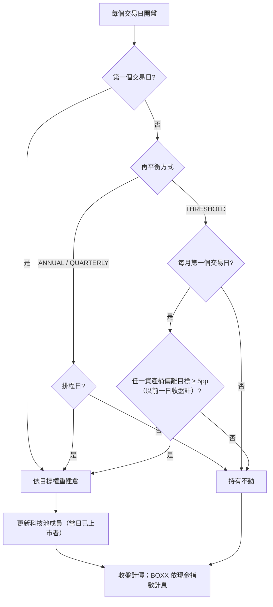

# 固定比例配置與定期再平衡（選項 A）(Static Allocation & Periodic Rebalancing)

## 1. 核心哲學與適用市場環境

### 1.1 為什麼放棄擇時
使用者主策略為 Buy & Hold，首要目標是**降低暴跌風險**，其次才是報酬。先前五份回測（動態轉倉引擎的三種配置與兩段期間、逃頂三級階梯、BOXX 大盤退場、[`08_regime_momentum_rotation.md`](08_regime_momentum_rotation.md) 的大盤三態 + 動能輪動）得到一致的結論：**沒有任何一種看價格訊號進出場的規則，能以比「固定地少持有一些股票」更便宜的代價降低暴跌風險。** 在同等下行風險下，這些規則的報酬都不優於「固定比例股票 + BOXX」，也就是一直被拿來當對照組的減碼 B&H。

因此選項 A 直接把這個對照組當成策略：股票與 BOXX 維持固定比例、定期再平衡，不做任何擇時。回撤主要由股票比例決定，使用者只需要回答一個問題：**我能承受多深的回撤？**

### 1.2 系統的角色
- 不再產生進出場、換股、停利建議。
- 只負責兩件事：**再平衡提醒**（到期或偏離門檻時），以及**真正的左尾警訊**（SEC 論點破滅、帳戶層級回撤與 CVaR，見 [`../risk_portfolio/07_downside_risk_sortino_var_cvar.md`](../risk_portfolio/07_downside_risk_sortino_var_cvar.md)）。
- 本文件目前只有離線回測；接入 production 前需另行規劃並經使用者同意。

### 1.3 適用與不適用
- 適用：長期持有、能接受「回撤大致與股票比例成正比」的投資人。
- 不適用：期待在急跌前全身而退的需求。固定比例不預測，只在事後以再平衡「逢低買回股票」。

---

## 2. 數學模型與量化推導

### 2.1 三個資產桶與目標權重
股票總比例 $E$、股票內科技池占比 $T$：

$$
w^{*}_{\text{TECH}} = E \cdot T, \qquad
w^{*}_{\text{VOO}} = E \cdot (1 - T), \qquad
w^{*}_{\text{BOXX}} = 1 - E
$$

科技池內部為 point-in-time 等權：再平衡當日「前一日有收盤、當日有開盤」的 $N_t$ 檔各 $w^{*}_{\text{TECH}} / N_t$。

### 2.2 再平衡觸發
- ANNUAL：每年第一個交易日。
- QUARTERLY：每季（1、4、7、10 月）第一個交易日。
- THRESHOLD：每月第一個交易日檢查，以前一日收盤計算資產桶權重 $w_{k}$，當

$$
\max_{k \in \{\text{TECH}, \text{VOO}, \text{BOXX}\}} \left| w_{k} - w^{*}_{k} \right| \ge \delta, \quad \delta = 5\ \text{pp}
$$

時才再平衡。

### 2.3 成本
再平衡當日開盤成交，股票成交金額 $\sum_i |\Delta q_i| \cdot P^{\text{open}}_i$ 乘上單邊成本 $c = 0.15\%$；BOXX 進出不計成本。成本自淨值扣除後，所有部位按比例縮減（與等權對照組相同作法）。

### 2.4 回撤體驗指標
除 Sortino（主）、MDD、CVaR95 外，另計：
- 最差 12 個月報酬：$\min_t \left( V_t / V_{t-252} - 1 \right)$
- 回撤恢復時間：最大回撤的高點 $t_p$ 到淨值首次收復 $V_{t_p}$ 的交易日數。

---

## 3. 決策邏輯與狀態機 / 流程圖

### 3.1 回測結果（2007-01-03 → 2025-12-31，日線）

Sortino 的 MAR 為期間內 BOXX／BIL 的實際年化報酬 1.38%。

**依目標最大回撤查表（每年再平衡，全期間 CAGR 最高者）**：

| 目標 MDD ≤ | 只用 VOO（最可信） | 科技 50% | 科技 100% |
|---|---|---|---|
| 25% | 股 40%：CAGR 5.5%、Sortino 0.78、MDD 23.7% | 股 40%：9.7%、1.33、20.9% | 股 40%：13.7%、1.61、21.5% |
| 30% | 股 50%：6.5%、0.76、29.6% | 股 50%：11.6%、1.31、26.3% | 股 50%：16.4%、1.59、27.3% |
| 35% | 股 50%（偏離）：6.5%、0.74、30.6% | 股 60%：13.4%、1.29、31.5% | 股 60%：19.0%、1.57、33.0% |
| 40% | 股 60%：7.4%、0.74、35.2% | 股 70%：15.2%、1.26、36.7% | 股 70%：21.5%、1.54、38.6% |

目標 MDD ≤ 20% 需要股票比例低於 40%，不在本次格點內。

**三段崩跌的區間回撤（每年再平衡）**：

| 配置 | 2008 | 2020 | 2022 | MDD 恢復時間 |
|---|---:|---:|---:|---|
| B&H VOO | 55.2% | 34.0% | 24.5% | 1,224 日 |
| B&H 等權科技池 | 55.3% | 29.7% | 43.2% | 506 日 |
| #19 大盤三態 + 動能 | 18.2% | 39.1% | 26.6% | 536 日 |
| 股 60%／VOO | 35.2% | 20.6% | 14.5% | 893 日 |
| 股 60%／科技 50% | 31.5% | 18.6% | 20.1% | 514 日 |
| 股 50%／科技 100% | 27.3% | 15.8% | 21.4% | 437 日 |

**觀察**：
1. 回撤幾乎與股票比例成正比：股 60% 的 2020 回撤約為 B&H 的 60%。固定比例在**急跌**（2020）的保護比 #19 的擇時策略好；#19 只在 2008 這種緩跌型空頭較好。
2. 再平衡方式：含科技池的配置，**每年一次**全面優於季度與偏離門檻（CAGR 高 1–4 個百分點、MDD 低 2–5 個百分點、換手較少）——季度再平衡在上漲趨勢中過早賣出贏家，偏離門檻模式的科技池成員名單很少更新（見 §5）。只用 VOO 的配置三種方式差距在 0.1 個百分點內。
3. Sortino 隨股票比例下降而**上升**（科技 100%：股 100% 1.44 → 股 40% 1.61），因為 BOXX 的報酬高於 MAR、且幾乎沒有下行。
4. 子期間：每個配置在 2007–2015 與 2016–2025 的 MDD 排序一致，CAGR 在後段一律較高。以全期間查表選出的配置，在兩段子期間的 MDD 都未超過目標；但若只看 2016–2025，同一目標會選到高出 10–40 個百分點的股票比例——**只用近 10 年資料挑比例，會低估回撤**；2007–2015 的最佳選擇則與全期間相同（2008 是決定性的一段）。

---

## 4. 關鍵具名常數與物理約束

| 常數 | 值 | 說明 | 位置 |
| :--- | :--- | :--- | :--- |
| `EQUITY_SHARES` | $\{1.0, 0.8, 0.7, 0.6, 0.5, 0.4\}$ | 股票總比例格點 $E$ | `calibration/static_allocation_backtest.py` |
| `TECH_SHARES` | $\{1.0, 0.5, 0.0\}$ | 股票內科技池占比格點 $T$ | 同上 |
| `REBALANCE_MODES` | ANNUAL／QUARTERLY／THRESHOLD | 再平衡方式 | 同上 |
| `drift_threshold` | $0.05$ | 偏離門檻 $\delta$ | `StaticAllocationParams` |
| `cost_rate` | $0.0015$ | 股票單邊交易成本，BOXX 不計 | 同上 |
| `TARGET_MDDS` | $\{20, 25, 30, 35, 40\}\%$ | 查表的目標最大回撤 | `scripts/run_static_allocation_backtest.py` |

---

## 5. 邊界條件、風控熔斷與例外處理

- **存活者偏差與事後挑選**：科技池是 2026 年挑的 22 檔，且 Yahoo 沒有已下市公司資料；科技占比越高，絕對報酬越偏樂觀。VOO 與 BOXX 不受此影響，因此「只用 VOO」那一欄最可信，科技池欄位應視為上限。
- **偏離門檻模式只看資產桶層級**：只有單一資產桶時（例如股 100%／科技 100%）永遠不會觸發；科技池成員名單只在再平衡時更新，新上市標的可能長期不被納入。該模式的科技池結果以年度再平衡為準。
- **科技池無可交易標的時**：科技桶的資金自然留在 BOXX，直到下一次再平衡。
- **時序**：再平衡的觸發與偏離判定只用前一日收盤，於當日開盤成交、收盤計價，無前視。
- **資料代理**：VOO 上市前以 SPY 串接；BOXX 上市前以 BIL、BIL 上市前以固定利率 4.5% 計息。
- **價格**：分割與股息調整後價格，屬總報酬近似；未模擬滑價與稅。
- **一致性驗證**：股 100%／科技 100%／每年 與 [`08_regime_momentum_rotation.md`](08_regime_momentum_rotation.md) 的等權對照組逐位元一致；股 100%／VOO 與 B&H VOO 的 CAGR 與 MDD 一致（測試把關）。

---

## 6. 核心程式碼檔案路徑關聯

- `nexus_core/calibration/static_allocation_backtest.py`：`StaticAllocationParams`、`simulate_static()`、`rebalance_calendar()`、`needs_rebalance()`、`max_drawdown_episode()`、`worst_rolling_return()`。
- `nexus_core/calibration/daily_panel.py`：日線面板載入、VOO／BOXX 代理銜接（與 #19 共用，資料處理逐位元一致）。
- `nexus_core/scripts/run_static_allocation_backtest.py`：全格點、三段崩跌、目標回撤查表、子期間穩定性、與 #19 及 B&H 並列；報告輸出到 gitignored 的 `reports/static_allocation/`。
- `nexus_core/tests/unit/test_static_allocation_backtest.py`：再平衡時點、偏離門檻邊界、成本、與等權對照組逐位元一致、point-in-time 加入、BOXX 計息、回撤恢復時間。
