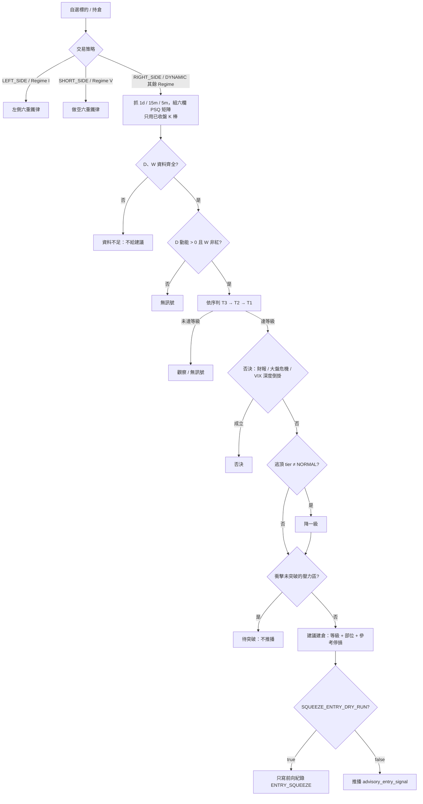

# 多時間框架擠壓進場與加碼技術規格書 (Multi-Timeframe Squeeze Entry)

> 狀態：2026-10 上線，**乾跑中**（`SQUEEZE_ENTRY_DRY_RUN = true`）。`/x` 面板立即顯示判定；推播需等前向樣本通過 [`../architecture/05_calibration_harness_and_forward_collection.md`](../architecture/05_calibration_harness_and_forward_collection.md) §5.8 G 的準則。日線事件研究（§3.2）顯示各等級**沒有統計顯著的擇時優勢**。

## 1. 核心哲學與適用市場環境

### 1.1 為什麼取代右側六重鐵律

系統的主策略是 Buy & Hold，定位是「自選標的的建倉／加碼時機顧問」。右側六重鐵律（[`02_right_side_momentum_ironclad.md`](02_right_side_momentum_ironclad.md)）不適用這個定位：

1. **設計目的已消失**：它原本是衛星輪動（情境二 `OPPORTUNITY_COST`）與 `CORE_DEPLOYMENT` 的放行閘門，兩者已於 v1.15.0 刪除。
2. **時間尺度不合**：以 15 分鐘放量陽線判定事件式突破，停損綁在 GEX Put Wall 且上限 8%，屬於短線衛星的風控，不是 B&H 的建倉邏輯。
3. **依賴期權流動性**：正 GEX 底牆需 ≥ 500k、UOA 名目需 ≥ \$200k。期權流動性差的小型股高機率 fail-closed，結果是永遠收不到建議。
4. **與區間中段的突破買點互斥**：若壓力位低於 60 日高點（晴空擴展不啟動），Call Wall 空間門檻會把「正在衝擊壓力區」的標的判成 Regime IV 封頂。

使用者的實際進場依據是多時間框架 PowerSqueeze、Daily Squeeze + Green Dots、3 日 Turbo 與橫向壓力區突破，搭配 1／1.5／2.5% 的部位。本規格把這套判斷系統化。

### 1.2 加碼為什麼也要換

`PYRAMID_ADD`（[`04_dynamic_rollover_state_machine.md`](04_dynamic_rollover_state_machine.md) §2.11）的條件二要求 `ratchet_stop >= avg_cost`。所有多頭現貨持倉都是顧問模式（`advisory_only = True`），而顧問模式會丟棄帶有 `dynamic_state_patch` 的 HOLD 指令（`advisory_mode.py` 規則一），所以棘輪停損**永遠不會寫入**——條件二恆不成立，加碼對 B&H 持倉從未觸發。條件二改為以擠壓參考停損即時計算，「停損 ≥ 成本」的不變式語意不變。

### 1.3 適用範圍

- 進場顧問（30 分鐘心跳的 `advisory_entry_signal`）與 `/x` 的「進場檢核」頁籤：交易策略為 `RIGHT_SIDE`，或 `DYNAMIC` 且 Regime 不是 I（左側）／V（做空）時。
- `PYRAMID_ADD` 條件二～四。
- 左側（[`03_left_side_mean_reversion_ironclad.md`](03_left_side_mean_reversion_ironclad.md)）與做空（[`07_short_side_breakdown_ironclad.md`](07_short_side_breakdown_ironclad.md)）鐵律不受影響。

## 2. 數學模型與量化推導

### 2.1 時間框架矩陣

六個時間框架：W、3D、D、65m、15m、5m。只需三次抓取：

| 時間框架 | 來源 | 重採樣規則 | 「已收盤」判定 |
| :--- | :--- | :--- | :--- |
| W | 2 年日線 | 週五為界 | 該週最後一日 < 今日 |
| 3D | 2 年日線 | 固定錨點（2020-01-02）起算的 NYSE 交易日序號 $\lfloor n/3 \rfloor$ 分組 | 組內滿 3 日且不含今日 |
| D | 2 年日線 | — | 日期 < 今日（今日一律視為未確認） |
| 65m | 1 個月 5m | 每日 09:30 起每 65 分鐘一根（一日恰 6 根），只取常規時段 | 起始 + 65 分 ≤ 現在 |
| 15m | 5 日 15m | — | 起始 + 15 分 ≤ 現在 |
| 5m | 1 個月 5m | — | 起始 + 5 分 ≤ 現在 |

**判定只用已收盤 K 棒**；盤中那一根另算一份「未確認預覽」只供顯示。固定錨點讓 3D 分組邊界每天不變——若以資料視窗起點分組，每多一天整串 3D K 棒都會位移。

### 2.2 PowerSqueeze 指標（`psq_engine.py`）

布林通道與三條 Keltner 通道（長度 $L = 20$）：

$$
\text{BB}_{\pm} = \text{SMA}_{20} \pm 2.0\,\sigma_{20}, \qquad \text{KC}^{(k)}_{\pm} = \text{EMA}_{20}(\text{Close}) \pm k \cdot \text{EMA}_{20}(\text{TR}),\quad k \in \{1.0, 1.5, 2.0\}
$$

擠壓等級取 BB 完全落在哪一條 KC 內：$k=1.0$ 為高強度、$1.5$ 為中強度、$2.0$ 為一般，皆不成立為「解除」。擠壓中 $\text{SQ}_t = [\text{BB} \subset \text{KC}^{(2.0)}]$。

動能為線性回歸終點值：

$$
M_t = \text{LinReg}_{20}\Big(\text{Close} - \tfrac{1}{2}\big(\tfrac{\max_{20}\text{High} + \min_{20}\text{Low}}{2} + \text{SMA}_{20}\big)\Big)
$$

動能色：$M_t > 0$ 且 $\Delta M_t > 0$ 為淺藍，$M_t > 0$ 且 $\Delta M_t \le 0$ 為深藍，$M_t < 0$ 且 $\Delta M_t < 0$ 為紅，$M_t < 0$ 且 $\Delta M_t \ge 0$ 為金。

- **Green Dot**（使用者定義：擠壓解除點）：近 $N$ 根內出現 $\text{SQ}_{j-1} \wedge \neg \text{SQ}_j$，且當前 $\neg\text{SQ}_t \wedge M_t > 0$。$N$ 見 §4。
- **Turbo**（Claude 建議、經使用者同意的定義）：動能色由非淺藍翻回淺藍。「3 日 Turbo」即 3D 時間框架的 Turbo。

### 2.3 自動壓力區（`squeeze_entry/resistance.py`）

近 60 個已收盤交易日中，High 為左右各 2 根內最高者為擺盪高點；依價位排序後，與群組錨點相距 $\le 0.5 \times \text{ATR}_{1D}$ 者併為同一區 $[Z_{\text{bottom}}, Z_{\text{top}}]$。

- **衝擊中**：最近的上方壓力區（$Z_{\text{top}} \ge \text{Spot}$）滿足 $\text{Spot} \ge Z_{\text{bottom}} - 0.5 \times \text{ATR}_{1D}$。
- **突破**：以突破前 3 根以前的 K 棒推得的壓力區，滿足 $\text{Close}_{t-3} \le Z_{\text{top}} < \text{Close}_t$ 且 $\text{Spot} > Z_{\text{top}}$；或日線未確認時，最後一根已收盤 65m 收盤站上前一日收盤上方的 $Z_{\text{top}}$。

### 2.4 等級與建議部位（`squeeze_entry/rules.py`）

前提（皆不成立即無訊號）：$M^{D} > 0$ 且 W 動能色不是紅。設 $n_{\text{sq}}$ 為擠壓中的時間框架數。

| 等級 | 條件 | 建議部位（占總資產） |
| :--- | :--- | :--- |
| T3 | D Green Dot；或 3D Turbo 且 $n_{\text{sq}} \ge 3$ | 2.5% |
| T2 | $n_{\text{sq}} \ge 3$、D 擠壓中且 D 動能淺藍 | 1.5% |
| T1 | W／3D／D 任一擠壓中，且 15m/5m 出現 Green Dot 或 Turbo（或壓力區突破） | 1% |
| 觀察 | $n_{\text{sq}} \ge 2$，尚無觸發（不推播） | — |

依序判 T3 → T2 → T1。衝擊中且未突破時，任何等級一律改為「待突破」（不推播）。逃頂警戒 tier ≠ NORMAL 時降一級（T1 降級即為觀察）。

### 2.5 參考停損

$$
\text{Stop} = \min\big(\text{D 最近一段擠壓區間最低價},\ \text{SMA}^{D}_{20}\big) - 0.5 \times \text{ATR}_{1D}
$$

刻意不用 15m/5m 的擠壓區間：日內區間對 B&H 部位過窄，會被日內雜訊洗掉。

### 2.6 加碼條件二～四（`dynamic_rollover/pyramid_add.py`）

2. $\text{Stop} \ge \text{AvgCost}$（§2.5；算不出來 fail-closed）。
3. $M^{D} > 0$，且 65m／D／3D／W 任一出現 Green Dot，或壓力區突破。
4. 不在「尚未突破的壓力區」衝擊範圍內。

倉位模型沿用原情境十：$Q_{\text{add}} = \big\lfloor \text{NAV} \cdot \min(0.5\%, f_{\text{kelly}}) \cdot m_{\text{VIX}} / (\text{Spot} - \text{Stop}) \big\rfloor$。

## 3. 決策邏輯與狀態機 / 流程圖

### 3.1 推播與前向紀錄

- 每次評估都寫 `regime_evaluation_log`（`evaluator = ENTRY_SQUEEZE`，`sub_mode` 存狀態、`conditions_mask` 存等級、矩陣與壓力區存 `features_json`），乾跑期間照常記錄。
- 去重鍵以等級入鍵（`advisory_entry_{uid}_{SYM}_SQZ_T{n}_{日期}`）：同日 T1 升級為 T3 是新的、更強的訊號，會再推播一次。
- 心跳非 green（防禦訊號）時不推播進場，與左側／做空路徑一致。

### 3.2 日線事件研究結果（2026-10-04）

`scripts/run_squeeze_entry_backtest.py --start 2015-01-01`；快取內 27 檔個股、60,472 個標的日。t+1 開盤進、t+h 收盤出；超額 = 報酬 − 同標的無條件平均；t 值的標準誤以獨立事件數（同標的同組 10 日冷卻）估。

| 分組 | 獨立事件 | 20 日超額 | 20 日 t | 60 日超額 | 60 日 t |
| :--- | ---: | ---: | ---: | ---: | ---: |
| T1 | 1,261 | +0.03% | +0.08 | −0.35% | −0.40 |
| T2 | 174 | +1.99% | +1.55 | −1.15% | −0.44 |
| T3 | 791 | +0.59% | +0.97 | +1.13% | +0.88 |
| 任一等級 | 1,576 | +0.32% | +0.79 | +0.06% | +0.08 |
| 待突破 | 401 | +1.29% | +1.50 | −0.35% | −0.23 |
| 觀察 | 744 | −1.14% | **−2.21** | −3.25% | **−3.08** |

**判讀**：

- 三個等級的超額報酬 $|t|$ 都 < 2：**與任意一天進場無法區分**。這與 [`09_static_allocation_rebalance.md`](09_static_allocation_rebalance.md) 的結論一致（日線擇時規則都沒有可驗證的 alpha）。
- 唯一顯著的是負向：多時間框架擠壓中、但動能還沒觸發的「觀察」狀態，之後明顯落後。支持「只看擠壓、沒有觸發就買」是錯的，等級規則要求觸發是對的。
- 「待突破」閘門沒有證據顯示有幫助或有害。
- 限制：只有日線，T1 只能由壓力區突破觸發、T2 只能由 W／3D／D 湊滿，都比 production 嚴格；盤中路徑只能靠前向紀錄驗證。未套用財報否決與逃頂降級。選股池事後挑選，只看相對基準的差異。

## 4. 關鍵具名常數與物理約束

| 常數 | 值 | 說明 | 位置 |
| :--- | :--- | :--- | :--- |
| `GREEN_DOT_LOOKBACK` | W 2、3D/D/65m/15m/5m 3 | Green Dot 解除後仍有效的根數 | `squeeze_entry/timeframes.py` |
| `_THREE_DAY_ANCHOR` | 2020-01-02 | 3D 分組固定錨點 | `squeeze_entry/timeframes.py` |
| `TIER_SIZE_PCT` | T1 1.0／T2 1.5／T3 2.5 | 建議部位（占總資產 %） | `squeeze_entry/rules.py` |
| `_MIN_SQUEEZE_MULTI` | 3 | 「多時間框架擠壓」門檻 | `squeeze_entry/rules.py` |
| `_MIN_SQUEEZE_FOR_WATCH` | 2 | 觀察狀態門檻 | `squeeze_entry/rules.py` |
| `_STOP_ATR_BUFFER` | 0.5 | 參考停損的 ATR 緩衝 | `squeeze_entry/rules.py` |
| `_LOOKBACK_SESSIONS` | 60 | 壓力區回看交易日數 | `squeeze_entry/resistance.py` |
| `_PIVOT_WING` | 2 | 擺盪高點左右根數 | `squeeze_entry/resistance.py` |
| `_CLUSTER_ATR_MULT` | 0.5 | 壓力區群聚容差（× ATR₁D） | `squeeze_entry/resistance.py` |
| `APPROACH_ATR_MULT` | 0.5 | 衝擊判定距離（× ATR₁D） | `squeeze_entry/resistance.py` |
| `_BREAKOUT_LOOKBACK` | 3 | 日線突破回看根數 | `squeeze_entry/resistance.py` |
| `SQUEEZE_ENTRY_DRY_RUN` | `true` | 只記錄、不推播 | `config.py` |

## 5. 邊界條件、風控熔斷與例外處理

- **fail-closed**：D 或 W 缺資料、參考停損算不出來、記憶體超過 85%（`is_memory_safe()`）時一律不給建議／不加碼。
- **否決**（`squeeze_entry/vetoes.py`）：財報緩衝期、大盤 `SHORT_GAMMA_CRITICAL`／`SYSTEMIC_LIQUIDITY_CRISIS`／`UNKNOWN`（沿用左側／做空共用的條件五），以及 VIX 期限結構 $\ge 1.10$ 深度倒掛。
- **不需要期權資料**：雷達（GEX）缺失時擠壓路徑照常評估，否則期權流動性差的小型股永遠收不到建議；左側與做空仍需要雷達。
- **刻意偏離原計畫的兩處**：
  1. **未套用 VIX 倉位乘數**。`get_vix_sizing_multiplier(vix, "DIRECTIONAL_LONG")` 走的是賣方階梯，VIX < 15 時乘數為 0，會讓平靜行情（擠壓最常出現的時候）所有建議變成 0%。面板只顯示等級部位，是否引入其他 VIX 調整待使用者決定。`PYRAMID_ADD` 的倉位模型沿用原設計，仍套用此乘數（VIX < 15 時加碼股數為 0）。
  2. **進場顧問不套用 `max_satellite_budget_pct`**：判定以 `(strategy:symbol, 15m bar)` 跨使用者共用快取，與使用者無關；部位上限只在加碼（條件七）套用。
- **錨點差異**：3D／W 的重採樣錨點可能與看盤軟體不同，需逐欄比對使用者的圖表後再調整。
- **翻轉 `SQUEEZE_ENTRY_DRY_RUN`**：依 architecture/05 §5.8 G；由人工決定，不得因單一案例翻轉。

## 6. 核心程式碼檔案路徑關聯

- `nexus_core/market_analysis/psq_engine.py`：`analyze_psq()`（Green Dot 回看窗、Turbo、擠壓區間低點）、`compute_psq_series()`（逐根序列，回測用）。
- `nexus_core/market_analysis/squeeze_entry/timeframes.py`：重採樣、已收盤截斷、`build_matrix()`、`fetch_psq_matrix()`。
- `nexus_core/market_analysis/squeeze_entry/resistance.py`：`detect_resistance()`。
- `nexus_core/market_analysis/squeeze_entry/rules.py`：`evaluate_squeeze_entry()`。
- `nexus_core/market_analysis/squeeze_entry/vetoes.py`：`resolve_long_entry_vetoes()`、`compute_macro_escape_tier()`。
- `nexus_core/market_analysis/squeeze_entry/evaluator.py`：`evaluate_symbol()`（進場顧問與加碼共用）。
- `nexus_core/market_analysis/intraday_pipeline/entry_advisor.py`：`_evaluate_squeeze_long()` 與策略路由。
- `nexus_core/market_analysis/intraday_pipeline/pipeline.py`：`_dispatch_entry_advisor_alert()`（乾跑閘門、去重鍵）。
- `nexus_core/market_analysis/dynamic_rollover/pyramid_add.py`：加碼條件二～四。
- `nexus_core/cogs/embed_builders/squeeze_entry_embeds.py`：`create_squeeze_entry_embed()`。
- `nexus_core/cogs/unified_terminal/symbol_view.py`：`/x` 進場檢核頁籤。
- `nexus_core/calibration/squeeze_entry_backtest.py`、`nexus_core/scripts/run_squeeze_entry_backtest.py`：日線事件研究。
