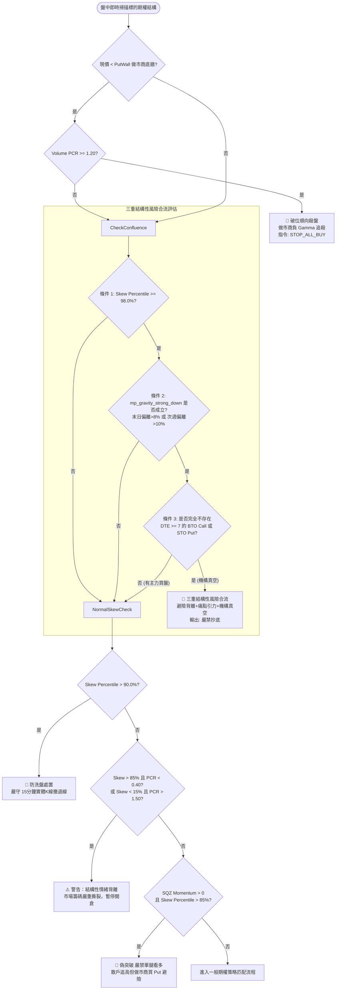

# Skew 偏斜與 Volume PCR 瀑布流背離及三重結構性風險合流閘門 (Skew/PCR Divergence & Triple Structural Risk Confluence)

## 1. 核心哲學與適用市場環境

### 1.1 期權 Skew 偏斜與尾部風險定價哲學
期權偏斜度（Volatility Skew）是造市商與機構對沖基金對市場下行黑天鵝風險定價的最敏感晴雨表。在 Black-Scholes-Merton 模型的理想幾何布朗運動假設下，相同標的與到期日的不同履約價隱含波動率（IV）應當相等（水平直線）。然而在真實美股市場中，由於市場參與者對暴跌的恐慌遠高於對暴漲的渴求，虛值賣權（OTM Put）的隱含波動率長期顯著高於虛值買權（OTM Call），形成所謂的「波動率微笑」或「偏斜（Skew）」。

當市場面臨潛在的流動性危機、宏觀事件衝擊或做市商預見內部籌碼破裂時，機構投資人會不計代價搶購 25-Delta 甚至 10-Delta 的深度價外 Put 避險，導致 Skew 分位數（Skew Percentile）急劇飆升至歷史極端（例如 $\ge 98\%$）。

### 1.2 Volume PCR 破位順向殺盤 (Waterfall Divergence)
成交量買賣權比率（Volume Put-Call Ratio, Volume PCR）反映了盤中即時流動性訂單流的極性傾斜。
當標的現貨價格跌破**做市商正 Gamma 底牆（Put Wall）**，且盤中 **$\text{Volume PCR} \ge 1.2$** 時，觸發系統最高危險等級的「破位順向殺盤」。

其微觀物理傳導機制如下：
1. **底牆崩塌**：現貨跌破 Put Wall，意味著市場失去了做市商最大的多頭正 Gamma 緩衝墊，瞬間跌入負 Gamma 踩踏泥淖。
2. **對沖反噬**：大量湧入的看跌期權（$\text{PCR} \ge 1.2$）迫使做市商持有巨額做空 Delta（$-\Delta$）。為了維持 Delta 中性，做市商必須在現貨與期貨市場進行「順向砸盤對沖」（跌越深越要拋售）。
3. **流動性真空暴跌**：做市商的主動砸盤與多頭追繳保證金爆倉合流，引發垂直下墜的瀑布流。此時若盲目進行基本面「價值抄底」或左側「技術接刀」，將遭遇不可逆的毀滅性本金虧損。

### 1.3 三重結構性風險合流 (Triple Structural Risk Confluence)
單一指標往往存在噪音，例如：
- Skew 極高有時僅是特定機構的事件前短暫過度對沖；
- Max Pain 向下引力有時會被強大現貨動能暫時突破；
- 缺乏機構大單有時僅是例行交投清淡。

然而，當 **「極端避險背離（$\text{Skew} \ge 98.0\%$）」**、**「痛點向下重力引力（$\text{mp\_gravity\_strong\_down}$）」** 與 **「機構買盤徹底真空（完全無 $\text{DTE} \ge 7$ 之多頭大單）」** 同時共振合流時，代表：
1. 造市商預判極端尾部下行；
2. 結算日重力中心死死拖拽價格向下；
3. 具有一週以上持倉視野的真正機構主力完全不願在現價進場承接。

這構成了美股微觀結構中的「完美風暴」。系統在此刻啟動一票否決制，強制宣告 `🚨 三重結構性風險合流：避險背離+痛點引力+機構真空，嚴禁抄底`。

---

## 2. 數學模型與量化推導

### 2.1 Skew 偏斜度與歷史百分位推導
定義標的合約 25-Delta Put 與 25-Delta Call 的隱含波動率之差為該期限的即時偏斜值：
$$\text{Skew} = \sigma_{\text{IV}}(25\Delta \text{ Put}) - \sigma_{\text{IV}}(25\Delta \text{ Call})$$

母體為日級規範樣本集 $\mathcal{S}_{N} = \{\text{Skew}_{d_1}, \dots, \text{Skew}_{d_N}\}$，$N \le 252$：每個 NYSE 交易日 $d$ 恰好一筆，取值為當日盤中 $[\text{open}_d, \text{close}_d]$ 的**最後一筆**觀測（半日市以 13:00 ET 為界），只收評估日之前的交易日（無前視偏差）。當前偏斜度的百分位採 midrank：
$$\text{Skew Percentile} = \frac{\#\{\text{Skew}_d < x\} + 0.5 \cdot \#\{\text{Skew}_d = x\}}{N} \times 100\%, \quad x = \text{Skew}_{\text{curr}}$$

另計算 robust Z 作為參考值（目前不作為閘門條件）：
$$Z_{\text{robust}} = \frac{x - \operatorname{median}(\mathcal{S}_N)}{\operatorname{IQR}(\mathcal{S}_N) / 1.349}, \quad \text{若 } \operatorname{IQR} < \text{ROBUST\_Z\_MIN\_IQR} \text{ 則 } Z_{\text{robust}} = \text{None}$$

- $\text{Skew Percentile} > 85.0\%$：市場進入高戒備避險區間；
- $\text{Skew Percentile} \ge 98.0\%$：市場進入全域極端尾部對沖狀態。

### 2.2 Volume PCR 與破位順向殺盤定理
設 $V_{\text{Put}}(K_i)$ 與 $V_{\text{Call}}(K_j)$ 分別為全鏈所有賣權與買權的盤中即時累積成交量：
$$\text{Volume PCR} = \frac{\sum_{i} V_{\text{Put}}(K_i)}{\sum_{j} V_{\text{Call}}(K_j)}$$

設 $\text{Put Wall}$ 為做市商累積最大正 GEX 之底牆履約價。當滿足以下聯立物理條件時，宣告觸發破位順向殺盤：
$$\text{Waterfall Condition} \iff \begin{cases} \text{Put Wall} > 0 \\ P_{\text{spot}} < \text{Put Wall} \\ \text{Volume PCR} \ge 1.20 \end{cases}$$

**處置邏輯**：
$$\text{Action Override} = \text{STOP\_ALL\_BUY}$$
全面凍結系統內所有多頭進場建議（包含現貨買入 SPOT_BUY、價內看漲買權 BTO_CALL 以及賣出賣權 CSP），直到價格有效重返 Put Wall 之上。

### 2.3 結構性情緒背離判定 (Structural Sentiment Divergence)
當做市商的尾部定價與散戶的即時成交量極性出現劇烈衝突時，代表市場內部籌碼發生嚴重撕裂：
$$\text{Structural Divergence} \iff \begin{cases} (\text{Skew Percentile} > 85.0 \land 0.0 < \text{Volume PCR} < 0.40) & \text{[散戶盲目追多，機構瘋狂買 Put 避險]} \\ \lor \\ (\text{Skew Percentile} < 15.0 \land \text{Volume PCR} > 1.50) & \text{[散戶恐慌踩踏，做市商 Put 溢價極低]} \end{cases}$$

輸出風控警告：
`[⚠️ 警告：結構性情緒背離] Skew 分位極端且 PCR 指向相反極端，市場內部籌碼嚴重分歧，指標失真度極高；建議暫停單方向開倉。`

### 2.4 微觀結構背離閘道 (Micro-Divergence Gate)
在動能交易體系中，PSQ (Pro Squeeze) 動能柱向上翻綠（$\text{SQZ Momentum} > 0$）通常被視為多頭突破信號。但若此時做市商避險情緒高漲（$\text{Skew Percentile} > 85.0\%$），該突破往往是做市商掩護出貨或假突破流動性獵殺：
$$\text{Micro Divergence} \iff (\text{SQZ Momentum} > 0) \land (\text{Skew Percentile} > 85.0)$$
輸出結果：
$$\text{Status Label} = \text{🚫 偽突破 (嚴禁單腿看多)}$$

### 2.5 三重結構性風險合流複合邏輯 (Triple Structural Risk Confluence)
定義三個正交的布林微觀結構命題：
1. **命題一：極端避險背離 ($C_{\text{skew}}$)**
   $$C_{\text{skew}} \iff \text{Skew Percentile} \ge 98.0$$
2. **命題二：多 DTE 痛點強下行引力 ($C_{\text{gravity}}$)**
   $$C_{\text{gravity}} \iff \text{mp\_gravity\_strong\_down} == \text{True}$$
   即存在 $0 \le \text{DTE} \le 1$ 且 $\text{dev} > +8.0\%$，或存在 $1 < \text{DTE} \le 14$ 且 $\text{dev} > +10.0\%$。
3. **命題三：主力買盤真空 ($C_{\text{vacuum}}$)**
   在過去一個交易日內檢測到的所有 UOA 異常訂單集合 $\mathcal{U}$ 中，不存在任何期限大於等於一週的實質多頭主力建倉單：
   $$C_{\text{vacuum}} \iff \neg \exists u \in \mathcal{U} \;\text{s.t.}\; \left( \text{DTE}(u) \ge 7 \;\land\; \big((\text{Action} = \text{BTO} \land \text{Type} = \text{CALL}) \lor (\text{Action} = \text{STO} \land \text{Type} = \text{PUT})\big) \right)$$

**合流判定公式**：
$$\text{Triple Confluence} = C_{\text{skew}} \land C_{\text{gravity}} \land C_{\text{vacuum}}$$

當 $\text{Triple Confluence} == \text{True}$ 時，觸發最高優先級覆寫：
$$\text{Status Label} \leftarrow \text{"三重結構性風險合流 🚨"}$$
$$\text{Tactical Advice} \leftarrow \text{"🚨 三重結構性風險合流：避險背離+痛點引力+機構真空，嚴禁抄底"}$$

---

## 3. 決策邏輯與狀態機 / 流程圖



---

## 4. 關鍵具名常數與物理約束

| 常數名稱 / 門檻 | 數值 / 設定 | 物理意義與代碼約束 | 核心程式碼檔案路徑 |
|---|---|---|---|
| `vol_pcr_waterfall_threshold` | $\ge 1.20$ | 觸發破位順向殺盤的買賣權成交量比率門檻 | `nexus_core/market_analysis/insights_engine.py` |
| `SKEW_TRIPLE_CONFLUENCE_PERCENTILE` | $\ge 98.0\%$ | 三重合流極端避險背離判定基準分位數 | `nexus_core/market_analysis/sentiment/skew_taxonomy.py` |
| `SKEW_HIGH_DEFENSE_PERCENTILE` | $> 90.0\%$ | 一般防洗盤處置、Skew Divergence Gate、左尾避險警示 | `nexus_core/market_analysis/sentiment/skew_taxonomy.py` |
| `SKEW_DIVERGENCE_HIGH_PERCENTILE` / `SKEW_DIVERGENCE_LOW_PERCENTILE` | $> 85.0\%$ / $< 15.0\%$ | 偽突破微觀結構背離閘道（ExecutionRouter 為 $\ge$）與 §2.3 結構性情緒背離 | `nexus_core/market_analysis/sentiment/skew_taxonomy.py` |
| `SKEW_NEUTRAL_PERCENTILE` | `50.0` | 百分位缺失或越界（非 0~100）時的中性值，不觸發任何尾端防禦 | `nexus_core/market_analysis/sentiment/skew_taxonomy.py` |
| `CANONICAL_WINDOW_DAYS` | `252` 交易日 | 日級規範母體的百分位視窗 | `nexus_core/market_analysis/sentiment/canonical_history.py` |
| `CANONICAL_MIN_SAMPLES` / `CANONICAL_MATURE_SAMPLES` | `20` / `60` 交易日 | 未滿 20 退回高頻池；滿 60 標記 `is_canonical=True` | `nexus_core/market_analysis/sentiment/canonical_history.py` |
| `ROBUST_Z_MIN_IQR` | Skew `0.25` 百分點 / PCR `0.05` | IQR 低於此值時 robust Z 回傳 `None`，避免資料源卡住時分母趨近 0 | `nexus_core/market_analysis/sentiment/canonical_history.py` |
| `pcr_fomo_lower_threshold` | $< 0.40$ | 散戶極度瘋狂追多門檻（結構背離比對用） | `nexus_core/market_analysis/intraday_pipeline/skew_commentary.py` |
| `pcr_panic_upper_threshold` | $> 1.50$ | 散戶非理性恐慌殺跌門檻（結構背離比對用） | `nexus_core/market_analysis/intraday_pipeline/skew_commentary.py` |
| `uoa_institutional_min_dte` | $\ge 7$ 天 | 判定實質機構買盤護航的最小到期日要求 | `nexus_core/cogs/embed_builders/market_embeds.py` |
| `uoa_aligned_actions` | `["BTO CALL", "STO PUT"]` | 視為實質看多/托底的異常期權交易動作定義 | `nexus_core/cogs/trading/heartbeat.py` |
| `_MIN_PERCENTILE_SAMPLES` | `20` 筆 | 高頻回退池樣本數低於此值時百分位直接回傳 `None`，而非用不足樣本假造極端值 | `nexus_core/market_analysis/sentiment/history_storage.py` |
| `SKEW_D25` | 歷史指標命名空間 | 真 25-Delta Skew 的專屬 history key，與改版前的 `SKEW`（±5% 價平代理）樣本互不混用 | `nexus_core/market_analysis/sentiment/skew_taxonomy.py` |

---

## 5. 邊界條件、風控熔斷與例外處理

### 5.1 判定層級優先序約束 (Evaluation Precedence)
在代碼實作中，`Triple Structural Risk Confluence` 的條件集合在邏輯上是 `skew_percentile > 90.0` 的嚴例子集。若代碼先執行：
```python
elif skew_percentile_val > 90.0:
    tactical_adv = "🛑 防洗盤處置，嚴守 15 分鐘實體 K 線撤退線"
```
則所有大於 98% 的三重合流情況將被該分支攔截，造成致命的**分流死碼（Dead Branch）**。因此在 `market_embeds.py:1263` 中，必須嚴格將三重合流判定置於 `> 90.0` 之前：
```python
elif (
    skew_percentile_val >= 98.0
    and mp_gravity_strong_down
    and not has_dte7_institutional_buy_support
):
    status_label = "三重結構性風險合流 🚨"
    tactical_adv = "🚨 三重結構性風險合流：避險背離+痛點引力+機構真空，嚴禁抄底"
```

### 5.2 UOA 機構買盤真空判定之邊界防護 (UOA Vacuum Guard)
若標的在全市場期權鏈中本日完全無任何 UOA 異動（`uoa_list` 為空列表），則遍歷迴圈將正常結束，`has_dte7_institutional_buy_support` 自然保持預設的 `False`。這符合量化物理直覺：完全沒有主力大單介入，就是最徹底的機構真空狀態。

### 5.3 單邊流動性與零成交量防護 (Zero Division in PCR)
若當日買權成交量為零（$\sum V_{\text{Call}} = 0$），在計算 `Volume PCR` 時可能引發除以零錯誤。代碼在 `insights_engine.py` 與 `market_embeds.py` 中均對 `vol_pcr` 進行空值與安全轉換（`_safe_float`），當成交量為零時安全賦值為 `None`，不觸發破位順向殺盤。

### 5.4 Skew 百分位的統計母體與樣本邊界防護 (Canonical Daily Population & Edge Guards)
`calculate_skew()` 的呼叫點遍布心跳、終端指令、Analyst runner 與委託單遙測，每次呼叫都寫入一筆 `sentiment_history`，取樣頻率不固定。舊實作以「最近 500 列」為母體，實際只涵蓋兩三週且相鄰樣本高度自相關：安靜期的微小跳動即可衝上高分位，連續數週的恐慌反而被當成常態。現行實作改為**雙軌**：

- **高頻日誌** `sentiment_history`：照常逐次寫入，保留 60 個交易日，只作為盤中觀測來源與冷啟動回退池。
- **日級規範母體** `sentiment_daily_canonical`（v080）：每標的 × 交易日 × 指標（`SKEW_D25`、`PCR`）恰好一筆，保留約 260 個交易日。寫入點有三個，共用同一個重採樣定義 `resample_daily_close()`：v080 migration 回填、16:15 ET `dynamic_after_market_report` 收盤快照、08:45 ET `pre_market_risk_monitor` 補寫前一交易日。三者皆為純 DB 重採樣、不抓網路（收盤後期權鏈 bid/ask 常歸零、IV 失真，盤後重抓的「收盤值」不可靠），寫入為 `INSERT OR IGNORE`，已寫入的交易日不會被覆寫。

邊界防護：
- **冷啟動回退**：規範母體未滿 `CANONICAL_MIN_SAMPLES = 20` 個交易日時，退回高頻池（最近 500 列），判定規則與改版前完全相同，閘門不會因母體切換而靜默失效；回傳的 `skew_percentile_source` 會標示 `CANONICAL` 或 `INTRADAY_FALLBACK`。
- **門檻數值不變**：母體切換只改變百分位的來源，§4 的門檻維持改版前的值。日級母體的尾端頻率與舊的高頻池不同，新門檻須以 `calibration/` 前向蒐集資料審核後再調整，不得憑推論修改。
- **最小樣本數防呆**：高頻池樣本數低於 `_MIN_PERCENTILE_SAMPLES = 20` 時回傳 `None`，而非讓單一筆歷史紀錄假造出 `0.0%` 或 `100.0%` 的極端偽訊號。
- **中位排序處理平局 (Midrank for Ties)**：兩個母體都採 $(count_{<} + 0.5 \times count_{=}) / n$，避免資料源卡死、樣本全相同時被誤判為 `0.0%`。
- **`None` 而非虛假中性值**：歷史紀錄為空或查詢異常時回傳 `None`（呼叫端各自 fail-safe 為中性 `50.0` 或跳過極端分支）。
- **`SKEW_D25` 命名空間隔離**：舊 `SKEW` 樣本（±5% 價平代理）永不混入，v080 回填也不做映射。
- **0~100 單一量綱**：全系統的 Skew 百分位一律是 0~100。遙測定價引擎的參數明確命名為 `skew_percentile_pct`，入口以 `ensure_percentile_pct()` 攔截越界值並 fail-open 為 `50.0`。**刻意不做**「$0 < x \le 1 \Rightarrow x \times 100$」的自動正規化：0~1% 正是合法的最低分位（看漲極端），自動放大會把它翻轉成看跌極端。

### 5.5 門檻重校準的否決紀錄與後續觀察 (Recalibration Record & Watch List)
日級規範母體上線時曾有提案把門檻調為「成熟期 $\ge 97.5\%$ **或** $Z_{\text{robust}} \ge 2.50$、過渡期兩者皆須成立」、防洗盤 $\ge 88\%$、偽突破 $\ge 82\%$，並以「$0 < x \le 1$ 時自動乘 100」修正量綱。這兩項都**未採用**：

- **調降門檻缺乏預測力依據**：以 CBOE ^SKEW × SPY（2000-01 ~ 2026-09，6,586 個交易日，只用過去 252 日的 midrank）代理研究，分位 $\ge 98$ 日之後 SPY 5 日內跌幅 $> 3\%$ 的機率為 10.3%、$\ge 90$ 為 9.9%、$\ge 85$ 為 9.4%，**都不高於**基準的 11.6%，5 日報酬的 bootstrap CI 也與基準重疊；反而 $\le 5$ 的低分位日為 18.4%（低 SKEW 常與高 VIX 的恐慌期重疊）。調降只會增加觸發次數。完整結果見 `calibration skew-proxy` 報告與 [`../architecture/05_calibration_harness_and_forward_collection.md`](../architecture/05_calibration_harness_and_forward_collection.md) §5.13。
- **成熟期 `OR` 比現行 $\ge 98$ 更寬鬆**，在沒有資料支持時等於放寬最高級防禦的觸發條件。
- **自動乘 100 會翻轉訊號**：0~1% 是合法的最低分位，放大後會變成看跌極端（見 §5.4 的 0~100 單一量綱）。

**後續觀察事項**（調整門檻前必須完成，依序）：

| # | 觀察項目 | 資料來源 | 判讀準則 |
|---|---|---|---|
| 1 | 日級母體的實際覆蓋 | `sentiment_daily_canonical`（每個 `symbol` 的 `SKEW_D25` 筆數）、`calculate_skew()` 回傳的 `skew_percentile_source` | 上線後 v080 回填讓多少標的直接進入 `CANONICAL`；其餘標的約 20 個交易日後才離開 `INTRADAY_FALLBACK`。全部標的長期停在回退池代表 16:15 快照或 08:45 補寫沒有執行（檢查 `📸 [Canonical 日級快照]` 日誌） |
| 2 | 分位來源切換後的觸發頻率 | 三重合流、防洗盤、偽突破訊息的每日則數 | 切換到日級母體後觸發頻率會改變（日級母體的尾端頻率與舊的 500 列池不同），這是預期中的；若單一標的連續多日每輪都觸發，檢查該標的母體是否被單一行情段支配 |
| 3 | robust Z 的可用率 | `skew_robust_z` 為 `None` 的比例 | `ROBUST_Z_MIN_IQR`（0.25 百分點）若使大部分標的 Z 為 `None`，代表下限過高；Z 目前只作參考，不影響閘門 |
| 4 | 門檻前向驗證 | `calibration forward-report` 的「門檻前向驗證 → Skew 分位區間」表（依 `CANONICAL`／`INTRADAY_FALLBACK` 分開） | 成熟標的（`skew_is_canonical`）累積 $\ge 60$ 個交易日、每個分位區間 $n \ge 100$ 後才可判讀。高分位組（85–90、90–98、$\ge 98$）的逆向先觸及率須**顯著高於** 15–85 組（bootstrap CI 不重疊），才有依據調整 `SKEW_*_PERCENTILE`；否則維持現值 |

調整時只改 `skew_taxonomy.py` 的具名常數（全部閘門共用），並同步更新 §4 常數表與 `test_canonical_resampling.py::test_skew_gate_thresholds_unchanged`。

---

## 6. 核心程式碼檔案路徑關聯

- **Volume PCR 破位順向殺盤引擎**:
  - `nexus_core/market_analysis/insights_engine.py`: `generate_terminal_insights()` (lines 58–70)
- **Skew 偏斜與結構性情緒背離規則**:
  - `nexus_core/market_analysis/intraday_pipeline/skew_commentary.py`: `build_watchlist_skew_rule_commentary()` (lines 14–182)
- **三重結構性風險合流與微觀背離閘道**:
  - `nexus_core/cogs/embed_builders/market_embeds.py`: lines 930–940 (微觀背離), lines 1100–1122 (DTE$\ge$7 機構買盤審計), lines 1263–1274 (三重合流處置)
- **Skew 百分位母體與門檻常數**:
  - `nexus_core/market_analysis/sentiment/canonical_history.py`: `resample_daily_close()`、`compute_canonical_stats()`、`snapshot_trading_day()`、`purge_stale_canonical_history()`
  - `nexus_core/market_analysis/sentiment/history_storage.py`: `get_indicator_percentile_detail()`（規範母體優先、高頻池回退）、`purge_stale_sentiment_history()`
  - `nexus_core/market_analysis/sentiment/skew_taxonomy.py`: 門檻具名常數與 `ensure_percentile_pct()`
  - `nexus_core/database/migrations/v080_add_sentiment_daily_canonical.py`: 資料表與回填
- **機構多頭對齊定義**:
  - `nexus_core/cogs/trading/heartbeat.py`: `is_uoa_aligned` 判定邏輯
