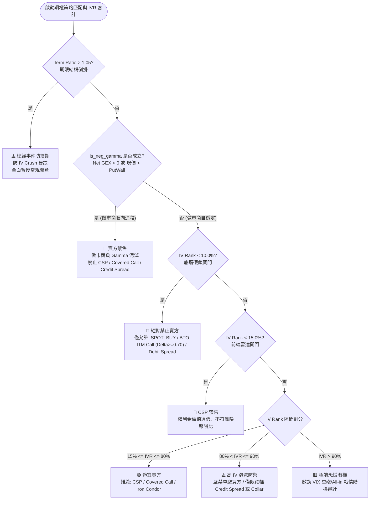

# IVR 波動率位階、做市商負 Gamma 賣方禁售與期權策略匹配閘門 (IVR Regimes, Dealer Seller Circuit Breakers & Strategy Gates)

## 1. 核心哲學與適用市場環境

### 1.1 隱含波動率位階 (IV Rank & IV Percentile) 的定價哲學
在期權交易中，隱含波動率（Implied Volatility, IV）是唯一由市場交易價格倒推而得的供需參數。然而，絕對 IV 數值在不同標的之間無法橫向比較——例如公用事業股的 25% IV 可能已是十年歷史極值（極度昂貴），而高成長科技股或生技股的 40% IV 可能處於歷史谷底（極度廉價）。

因此，量化系統必須將絕對 IV 標準化為 **IV Rank (IVR)** 與 **IV Percentile (IVP)**。這兩個指標定義了當前權利金相對於過去一整年歷史軌跡的相對溢價水準，是決定**「站在買方（買入低估波動率）」**還是**「站在賣方（收割高估波動率）」**的最核心決策基準。

### 1.2 做市商負 Gamma 泥淖與賣方一票否決制 (Short Gamma Seller Lockout)
選擇權賣方（如現金擔保賣權 CSP、無掩護賣權 Naked Put 或賣方信用價差 Credit Spread）的勝率優勢，建立在做市商處於正 Gamma（Long Gamma）的「均值回歸自穩定環境」中。在正 Gamma 環境中，做市商「逢低買入、逢高拋售」，有效壓制市場波動，為期權賣方提供穩定的時間價值衰減（Theta Decay）。

然而，一旦做市商轉入**負 Gamma（Short Gamma）泥淖**（全鏈 $\text{Net GEX} < 0$ 或現貨跌穿 $\text{Put Wall}$）：
1. 做市商轉變為「順向追殺者」——現貨下跌時做市商被迫砸盤對沖 Delta，下跌引發拋售，拋售進一步引發恐慌暴跌。
2. 在此環境下，期權賣方收取的微薄權利金根本無法彌補標的跳空穿針造成的非線性巨額損失（Gamma Risk 徹底失控）。
3. 因此，Nexus Seeker 確立**做市商負 Gamma 一票否決制**：無論當前 IVR 高達多少，只要陷入負 Gamma 泥淖，系統強制啟用 **`🔴賣方禁售`**，絕對禁止任何做空波動率行為。

### 1.3 低 IVR 賣方硬鎖與買方優勢空間
當標的處於低波動環境時（$\text{IVR} < 10\%$ 底層硬鎖 / $\text{IVR} < 15\%$ 前端警示），期權權利金極度廉價。賣方承擔著完整的尾部風險與方向性風險，但潛在收益極低，風險報酬比嚴重惡化。此時是買方的黃金窗口，系統硬鎖所有賣方策略，引導資金轉向：
- **現貨直接買入 (SPOT_BUY)**；
- **深度價內買權替代現股 (BTO ITM Call, $\Delta \ge 0.70$)**；
- **借方價差策略 (Debit Spread)**。

---

## 2. 數學模型與量化推導

### 2.1 IV Rank 與 IV Percentile 數學定義
採集標的資產在過去 252 個交易日（1 年）的日線歷史隱含波動率觀測樣本序列：
$$\mathcal{V}_{252} = \{\sigma_1, \sigma_2, \dots, \sigma_{252}\}$$
$$\sigma_{\min} = \min(\mathcal{V}_{252}), \quad \sigma_{\max} = \max(\mathcal{V}_{252})$$

#### 1. IV Rank (IVR) 公式
IV Rank 衡量當前隱含波動率相對於歷史極值區間的極差相對位置：
$$\text{IV Rank} = \begin{cases} \left( \frac{\sigma_{\text{curr}} - \sigma_{\min}}{\sigma_{\max} - \sigma_{\min}} \right) \times 100\%, & \text{若 } \sigma_{\max} > \sigma_{\min} \\ 50.0\%, & \text{若 } \sigma_{\max} = \sigma_{\min} \end{cases}$$
值域嚴格約束在 $[0.0, 100.0]$。

#### 2. IV Percentile (IVP) 公式
IV Percentile 衡量當前隱含波動率高於過去一年中多少比例的交易日（經驗分佈函數）：
$$\text{IV Percentile} = \left( \frac{1}{252} \sum_{t=1}^{252} \mathbf{1}_{\{\sigma_t < \sigma_{\text{curr}}\}} \right) \times 100\%$$
值域嚴格約束在 $[0.0, 100.0]$。

#### 3. 物理常識校驗約束 (Sanity Check)
若計算得出 $\text{IV Rank} > 70.0\%$，但當前絕對年化隱含波動率卻異常低於 5%（$\sigma_{\text{curr}} < 0.05$），代表歷史觀測樣本存在嚴重畸形或資料源丟包，系統強制拋出異常阻斷：
$$\text{Conflict Alert} \iff (\text{IV Rank} > 70.0\%) \land (\sigma_{\text{curr}} < 0.05)$$

### 2.2 四階波動率位階劃分 (IV Tiers)
系統依據 IV Rank 將市場環境劃分為四種微觀波幅狀態：
$$\text{IV Status} = \begin{cases} \text{Low (低波動)}, & \text{若 } \text{IV Rank} < 30.0\% \\ \text{Normal (正常波動)}, & \text{若 } 30.0\% \le \text{IV Rank} \le 70.0\% \\ \text{High (高波動)}, & \text{若 } 70.0\% < \text{IV Rank} \le 90.0\% \\ \text{Extreme (極端恐慌 / 泡沫)}, & \text{若 } \text{IV Rank} > 90.0\% \end{cases}$$

### 2.3 期限結構倒掛檢驗模型 (Term Structure Backwardation)
計算近月合約與遠月合約的隱含波動率比率：
$$\text{Term Ratio} = \frac{\bar{\sigma}_{\text{Near}} (\text{DTE} \le 14)}{\bar{\sigma}_{\text{Far}} (\text{DTE} \in [15, 60])}$$

- **倒掛狀態 ($\text{Term Ratio} > 1.05$)**：
  近端波動率顯著高於遠端，表明市場在定價即將到來的重大突發事件（如財報開牌、FDA 審批、總經會議）。此時事件後將遭遇毀滅性的「隱含波動率暴跌（IV Crush）」，系統標記 **`⚠️總經事件防禦期`**，全面封鎖單腿買方與左側賣方。
- **正價差狀態 ($\text{Term Ratio} < 0.95$)**：
  遠端波動率高於近端，為正常期權期限結構（Contango）。

### 2.4 做市商負 Gamma 泥淖量化定義
設 $\text{Net GEX}$ 為做市商在該標的上的全鏈淨 Gamma 曝險，$\text{Put Wall}$ 為最大正 Gamma 底牆。負 Gamma 泥淖判定布林值定義為：
$$\text{is\_neg\_gamma} \iff (\text{Net GEX} < 0) \lor (\text{Put Wall} > 0 \land P_{\text{spot}} < \text{Put Wall})$$

當 $\text{is\_neg\_gamma} == \text{True}$ 時，觸發風控覆寫：
$$\text{Strategy Routing} \leftarrow \text{"🔴賣方禁售"}$$

---

## 3. 決策邏輯與狀態機 / 流程圖



---

## 4. 關鍵具名常數與物理約束

| 常數名稱 / 門檻 | 數值 / 設定 | 物理意義與代碼約束 | 核心程式碼檔案路徑 |
|---|---|---|---|
| `_IVR_SELLING_LOCKOUT` | `10.0` ($10.0\%$) | 底層硬鎖門檻，低於此值絕對禁止所有賣方策略 | `nexus_core/market_analysis/ivr_strategy_gate.py` |
| `_LOW_IVR_THRESHOLD` | `15.0` ($15.0\%$) | 前端雷達標註 `🔴CSP 禁售` 的安全閾值 | `nexus_core/market_analysis/option_guidance.py` |
| `_ITM_CALL_MIN_DELTA` | `0.70` | IVR 硬鎖狀態下允許替代現貨的買方 ITM Call 最低 Delta | `nexus_core/market_analysis/ivr_strategy_gate.py` |
| `term_structure_ratio_limit` | `1.05` | 期限結構倒掛判定線，超過即觸發總經事件防禦 | `nexus_core/cogs/embed_builders/market_embeds.py` |
| `iv_rank_low_bound` | `30.0\%` | 低波動 (Low Tier) 上界 | `nexus_core/market_analysis/sentiment/iv_metrics.py` |
| `iv_rank_normal_bound` | `70.0\%` | 正常波動 (Normal Tier) 上界 | `nexus_core/market_analysis/sentiment/iv_metrics.py` |
| `iv_rank_high_bound` | `90.0\%` | 高波動 (High Tier) 上界 | `nexus_core/market_analysis/sentiment/iv_metrics.py` |
| `bubble_iv_defense_cap` | `80.0\%` | 進入波動率泡沫防禦、禁止單腿買方的上限門檻 | `nexus_core/cogs/embed_builders/market_embeds.py` |

---

## 5. 邊界條件、風控熔斷與例外處理

### 5.1 IVR = 0.0 數據缺失不誤殺 (Missing Data Guard)
在盤前時段或歷史資料庫初次冷啟動時，若缺少歷史 252 日 IV 序列，系統計算出的 `iv_rank` 可能為 `0.0`。若機械式執行 `ivr < 10.0`，將導致所有標的被錯誤鎖死。`ivr_strategy_gate.py:39` 明確設置安全防護：
```python
if ivr <= 0.0:
    # IVR == 0.0 通常代表數據缺失或盤前，不由此閘門處理
    return False
return ivr < _IVR_SELLING_LOCKOUT
```
確保資料缺失時由降級系統平滑處理，不產生偽鎖死。

### 5.2 負 Gamma 踩踏區優先覆寫一切 IVR (Gamma Overrides IVR)
在市場崩盤期間，隱含波動率往往暴增至 90% 以上（極高 IVR）。傳統教科書常盲目建議此時「大舉賣出 Put 收取天價權利金」。然而，如果做市商全鏈處於負 Gamma 泥淖，現貨隨時可能引發無量跌停或流動性斷裂。因此在 `market_embeds.py:1140` 中：
```python
if is_iv_backwardation:
    iv_strategy_str = "⚠️總經事件防禦期"
elif is_neg_gamma:
    iv_strategy_str = "🔴賣方禁售"
elif iv_rank_val < 15.0:
    iv_strategy_str = "🔴CSP 禁售"
else:
    iv_strategy_str = "🟢適宜賣方"
```
負 Gamma 狀態的排位優先於 `iv_rank`，徹底杜絕在火山口賣 Put 的毀滅性行為。

---

## 6. 核心程式碼檔案路徑關聯

- **IV Rank / Percentile 計算與期限結構分析**:
  - `nexus_core/market_analysis/sentiment/iv_metrics.py`: `fetch_and_calculate_iv_metrics()`, `_calculate_iv_term_structure()`
- **IVR 策略硬鎖閘門模組**:
  - `nexus_core/market_analysis/ivr_strategy_gate.py`: `is_selling_locked_by_ivr()`, `get_ivr_lockout_allowed_strategies()`
- **期權操作指引與策略匹配**:
  - `nexus_core/market_analysis/option_guidance.py`: `derive_watchlist_option_guidance()` (lines 33–121)
- **雷達終端視覺化與負 Gamma 賣方禁售渲染**:
  - `nexus_core/cogs/embed_builders/market_embeds.py`: lines 703–705 (is_neg_gamma 定義), lines 1140–1150 (IV 策略匹配)
- **風控優化器 NRO 整合**:
  - `nexus_core/risk_engine/nro.py`: lines 61–82
