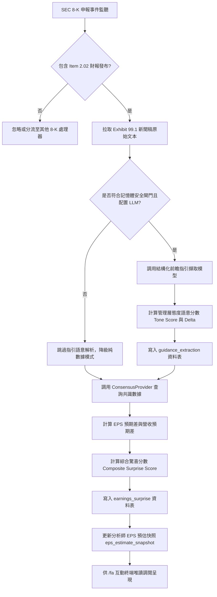

# 財務預期差綜合評分、管理層指引語意解析與共識快照規格書

---

## 1. 核心哲學與適用市場環境

### 1.1 核心哲學
在美股市場的季度財報發布季中，股價的短期定價重估與中長期盈餘公布後漂移（Post-Earnings Announcement Drift, PEAD）並非單純取決於企業當期的絕對獲利金額，而是取決於實際披露業績相對於市場共識預期的偏差程度（Surprise Degree），以及管理層對未來季度的前瞻指引（Forward Guidance）。

Nexus Seeker 基本面分析管線 PR3 聚焦於個股 8-K Item 2.02 重大財報事件之預期差度量與結構化指引擷取，其核心架構哲學如下：
1. **雙維預期差綜合量化**：同時度量每股盈餘（EPS）與營業收入（Revenue）之雙維預期差，防範單純營收增長但利潤惡化或會計調整造成的訊號扭曲。
2. **物理基準保護與奇點防禦**：設定每股盈餘分母門檻 $\text{FLOOR}_{\text{EPS}} = 0.05$ 美元，防範微利或損益兩平微小共識值導致百分比除以接近零的數學極端奇點，並標註小基數特徵。
3. **管理層前瞻態度語意量化**：針對 8-K Exhibit 99.1 新聞稿文本，運用結構化解析技術精準擷取訂單積壓、定價權自信、供應鏈韌性與防禦姿態四維態度語意評分，補足純財務數字的滯後性。
4. **100% 免費數據源與隨插即用**：共識預期以公開免費之 Finnhub API 為基準，付費數據庫與耳語平台（Whisper）全面掛載空實作（Null Providers），維持零成本運行。
5. **零交易執行不變量 (Zero-Execution Invariant)**：所有預期差分數與指引邊際變更均為純顧問性分析，絕無自動實體下單或平倉處置。

### 1.2 適用市場環境
- **盤前 (BMO) 與盤後 (AMC) 財報發布**：即時解析 8-K Item 2.02 申報，計算預期差分數與利潤率指引走向。
- **盈餘公布後漂移 (PEAD) 捕捉期**：在業績發布後的 60 個交易日內，透過大幅正向預期差與分析師上調動能共振，識別基本面強勁支撐。
- **利潤率擴張與承壓警示**：精準偵測管理層指引中毛利率或營益率由擴張轉為承壓的邊際惡化轉折。

---

## 2. 數學模型與量化推導

### 2.1 每股盈餘與營業收入雙維預期差模型
針對個股 8-K Item 2.02 所披露之季度業績，分別計算每股盈餘（EPS）與營業收入（Revenue）之百分比預期差：

$$\text{Surprise}_{\text{EPS}} = \frac{\text{Actual}_{\text{EPS}} - \text{Consensus}_{\text{EPS}}}{\max(|\text{Consensus}_{\text{EPS}}|, \text{FLOOR}_{\text{EPS}})}$$

$$\text{Surprise}_{\text{REV}} = \frac{\text{Actual}_{\text{REV}} - \text{Consensus}_{\text{REV}}}{|\text{Consensus}_{\text{REV}}|}$$

- 門檻參數：$\text{FLOOR}_{\text{EPS}} = 0.05$ 美元。當 $|\text{Consensus}_{\text{EPS}}| < 0.05$ 時，分母強制定錨為 $0.05$，且標記 $\text{small\_base} = \text{True}$。
- 雙向箝制：
  $$\text{Surprise}_{\text{EPS}} \in [-0.50, +0.50]$$
  $$\text{Surprise}_{\text{REV}} \in [-0.10, +0.10]$$

### 2.2 買方耳語預期差模型 (Whisper EPS Surprise)
當獲取買方耳語預期 $\text{Whisper}_{\text{EPS}}$ 時，額外計算買方預期差：

$$\text{Surprise}_{\text{Whisper}} = \frac{\text{Actual}_{\text{EPS}} - \text{Whisper}_{\text{EPS}}}{\max(|\text{Whisper}_{\text{EPS}}|, \text{FLOOR}_{\text{EPS}})}$$

雙向箝制於 $[-0.50, +0.50]$ 區間內。

### 2.3 綜合驚喜分數模型 (Composite Surprise Score)
將雙維預期差轉換為標準化量綱，並依基準權重（EPS 60%，Revenue 40%）融合成綜合驚喜分數：

$$\text{Surprise Score} = \text{clip}\left( 100 \times \left[ 0.60 \times \frac{\text{Surprise}_{\text{EPS}}}{0.50} + 0.40 \times \frac{\text{Surprise}_{\text{REV}}}{0.10} \right], -100.0, +100.0 \right)$$

- **單項缺失重新正規化機制**：
  若僅有每股盈餘數據，則權重正規化為 $1.0$：
  $$\text{Surprise Score} = \text{clip}\left( 100 \times \frac{\text{Surprise}_{\text{EPS}}}{0.50}, -100.0, +100.0 \right)$$
  若僅有營業收入數據，則權重正規化為 $1.0$：
  $$\text{Surprise Score} = \text{clip}\left( 100 \times \frac{\text{Surprise}_{\text{REV}}}{0.10}, -100.0, +100.0 \right)$$
  若兩者皆缺失則回傳無效（`None`）。

### 2.4 管理層態度語意評分 (Management Tone Score)
由結構化前瞻指引模型產出四項核心維度評分 $s_i \in [-2, +2]$：
1. $s_1$（訂單積壓與需求強度，`backlog_tone`）
2. $s_2$（定價權自信度，`pricing_power_tone`）
3. $s_3$（供應鏈韌性與交付順暢度，`supply_chain_tone`）
4. $s_4$（防禦姿態與逆風因應，`defensive_posture_tone`）

加權平均分數並線性映射至 $[-100.0, +100.0]$：

$$\text{Tone Score} = \text{clip}\left( \frac{\sum_{i=1}^{4} w_i s_i}{2.0} \times 100.0, -100.0, +100.0 \right)$$

其中等權重設定為 $w_1 = w_2 = w_3 = w_4 = 0.25$。態度邊際變化分數（Tone Delta）為：

$$\Delta_{\text{Tone}} = \text{Tone}_t - \text{Tone}_{t-1}$$

### 2.5 前瞻指引邊際變動與仲裁狀態機 (Guidance Delta)
比對當期前瞻指引與前期指引之數值變化：

$$\Delta_{\text{REV}} = \frac{\text{Guidance}_{\text{REV}, t} - \text{Guidance}_{\text{REV}, t-1}}{\text{Guidance}_{\text{REV}, t-1}}$$

$$\Delta_{\text{EPS}} = \frac{\text{Guidance}_{\text{EPS}, t} - \text{Guidance}_{\text{EPS}, t-1}}{\max(|\text{Guidance}_{\text{EPS}, t-1}|, \text{FLOOR}_{\text{EPS}})}$$

仲裁狀態機：
$$\text{Verdict} = \begin{cases}
\text{RAISED} & \text{若 } (\Delta_{\text{REV}} \ge +1.0\% \lor \Delta_{\text{EPS}} \ge +1.0\%) \land \neg(\Delta_{\text{REV}} \le -1.0\% \lor \Delta_{\text{EPS}} \le -1.0\%) \\
\text{LOWERED} & \text{若 } (\Delta_{\text{REV}} \le -1.0\% \lor \Delta_{\text{EPS}} \le -1.0\%) \land \neg(\Delta_{\text{REV}} \ge +1.0\% \lor \Delta_{\text{EPS}} \ge +1.0\%) \\
\text{MAINTAINED} & \text{數值變化處於 } \pm 1.0\% \text{ 區間內} \\
\text{UNKNOWN} & \text{無明確前後期數值指引}
\end{cases}$$

---

## 3. 決策邏輯與狀態機 / 流程圖

---

## 4. 關鍵具名常數與物理約束

| 具名常數 | 數值 / 類型 | 物理意義與約束說明 |
|---|---|---|
| `FLOOR_EPS` | `0.05` (float) | 每股盈餘分母基準門檻，防範除以接近零奇點 |
| `EPS_SURPRISE_CLIP` | `0.50` (float) | 每股盈餘預期差雙向箝制上限（±50%） |
| `REV_SURPRISE_CLIP` | `0.10` (float) | 營業收入預期差雙向箝制上限（±10%） |
| `WEIGHT_EPS` | `0.60` (float) | 綜合驚喜分數中每股盈餘之基準分配權重 |
| `WEIGHT_REV` | `0.40` (float) | 綜合驚喜分數中營業收入之基準分配權重 |
| `SCORE_CLIP` | `100.0` (float) | 綜合驚喜分數雙向箝制上限（±100.0） |
| `TONE_SCORE_CLIP` | `100.0` (float) | 管理層態度語意分數雙向箝制上限（±100.0） |
| `RAISE_THRESHOLD_PCT` | `0.01` (float) | 調升指引裁決之邊際增長門檻（+1.0%） |
| `LOWER_THRESHOLD_PCT` | `-0.01` (float) | 調降指引裁決之邊際下降門檻（-1.0%） |
| `SEC_STREAM_BYTE_CAP` | `1_500_000` (int) | SEC 文件下載位元組硬截斷上限（1.5MB，防禦 VPS OOM） |

---

## 5. 邊界條件、風控熔斷與例外處理

1. **分母接近零保護**：
   若分析師共識每股盈餘處於 $[-0.05, +0.05]$ 區間，強制以 $0.05$ 作為分母，避免極端數值發散並在結果中標註 `small_base = True`。
2. **單項缺失自適應重新正規化**：
   若因數據源延遲僅能獲取營收或僅能獲取盈餘數據，系統將單項權重自動重新正規化至 1.0，嚴禁因單一欄位缺失導致整個預期差計算崩潰。
3. **記憶體安全閘門 (85% RAM)**：
   在執行新聞稿前瞻指引語意擷取前，強制檢查系統記憶體水位。若總負載達 85% 以上，立即跳過語意解析，降級維持純數字預期差計算，保障系統穩定。
4. **付費源隔離與空實作保護**：
   耳語預期與付費機構共識一律配置空實作（Null Providers），避免在無憑證環境下引發連線超時或計費異常。
5. **資料庫單一寫入原則**：
   所有預期差入庫與快照更新皆透過單一寫入佇列執行，讀取端具備零寫入副作用。

---

## 6. 核心程式碼檔案路徑關聯

- 預期差純量化計算模組：`nexus_core/market_analysis/fundamental_pipeline/earnings_surprise.py`
- 前瞻指引與態度語意模組：`nexus_core/market_analysis/fundamental_pipeline/guidance_delta.py`
- 市場共識數據抽象提供者：`nexus_core/services/fundamental_providers.py`
- 財務預期差協調與指引服務：`nexus_core/services/earnings_surprise_service.py`
- 資料庫遷移與資料表定義：`nexus_core/database/migrations/v092_add_earnings_surprise.py`
- 資料庫持久層讀寫實作：`nexus_core/database/fundamental_pipeline.py`
- 基本面互動診斷終端：`nexus_core/cogs/fundamental_terminal.py`
- 全景診斷 Embed 構建器：`nexus_core/cogs/embed_builders/fundamental_embeds.py`
