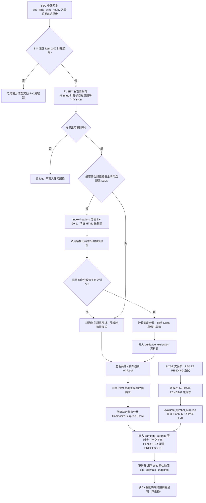

# 財務預期差綜合評分、管理層指引語意解析與共識快照規格書

> **接線狀態（已接線，只入庫不推播）**：`EarningsSurpriseService` 由兩條路徑觸發，規則見 §2.9。(1) **事件觸發**：SEC 申報同步 `sec_filing_sync_hourly`（平日 07:00–20:00 ET 每整點，見 [`06_sec_event_stream_and_governance_gate.md`](../macro_sentiment/06_sec_event_stream_and_governance_gate.md)）發現標的池（持倉＋自選，≤ 80 檔）新的 8-K / 8-K/A Item 2.02 時呼叫 `process_filing_event`，首次同步的 30 天回填事件同樣處理。(2) **PENDING 重試**：`earnings_pending_retry_1730`（NYSE 交易日 17:30 ET）對近 14 個日曆日內仍為 `PENDING` 的財季呼叫 `evaluate_symbol_surprise`。結果寫入 `earnings_surprise`、`guidance_extraction`、`eps_estimate_snapshot`，供 `/fa` 與後續估值模組唯讀使用，**不推播**。`/fa` 沒有資料時顯示「⚪ 尚無財報預期差資料（待下一份財報 8-K 觸發；僅涵蓋持倉與自選標的）」，各子項（預期差、指引、共識快照）缺資料時分別標示「（待下一份財報 8-K 觸發）」。

---

## 1. 核心哲學與適用市場環境

### 1.1 核心哲學
在美股市場的季度財報發布季中，股價的短期定價重估與中長期盈餘公布後漂移（Post-Earnings Announcement Drift, PEAD）並非單純取決於企業當期的絕對獲利金額，而是取決於實際披露業績相對於市場共識預期的偏差程度（Surprise Degree），以及管理層對未來季度的前瞻指引（Forward Guidance）。

Nexus Seeker 基本面分析管線 PR3 聚焦於個股 8-K Item 2.02 重大財報事件之預期差度量與結構化指引擷取，其核心架構哲學如下：
1. **雙維預期差綜合量化**：同時度量每股盈餘（EPS）與營業收入（Revenue）之雙維預期差，防範單純營收增長但利潤惡化或會計調整造成的訊號扭曲。
2. **物理基準保護與奇點防禦**：設定每股盈餘分母門檻 $\text{FLOOR}_{\text{EPS}} = 0.05$ 美元，防範微利或損益兩平微小共識值導致百分比除以接近零的數學極端奇點，並標註小基數特徵。
3. **管理層前瞻態度語意量化**：針對 8-K Exhibit 99.1 新聞稿文本，運用結構化解析技術精準擷取訂單積壓、定價權自信、供應鏈韌性與防禦姿態四維態度語意評分，補足純財務數字的滯後性。
4. **100% 免費數據源與隨插即用**：共識預期以公開免費之 Finnhub API 為基準，付費數據庫與耳語平台（Whisper）全面掛載空實作（Null Providers），維持零成本運行。
5. **零交易執行不變量 (Zero-Execution Invariant)**：所有預期差分數與指引邊際變更均為純顧問性分析，絕無自動實體下單或平倉處置。

### 1.2 適用市場環境
- **盤前 (BMO) 與盤後 (AMC) 財報發布**：即時解析 8-K Item 2.02 申報，計算預期差分數與利潤率指引走向。
- **盈餘公布後漂移 (PEAD) 捕捉期**：在業績發布後的 60 個交易日內，透過大幅正向預期差與分析師上調動能共振，識別基本面強勁支撐。
- **利潤率擴張與承壓警示**：精準偵測管理層指引中毛利率或營益率由擴張轉為承壓的邊際惡化轉折。

---

## 2. 數學模型與量化推導

### 2.1 每股盈餘與營業收入雙維預期差模型
針對個股 8-K Item 2.02 所披露之季度業績，分別計算每股盈餘（EPS）與營業收入（Revenue）之百分比預期差：

$$\text{Surprise}_{\text{EPS}} = \frac{\text{Actual}_{\text{EPS}} - \text{Consensus}_{\text{EPS}}}{\max(|\text{Consensus}_{\text{EPS}}|, \text{FLOOR}_{\text{EPS}})}$$

$$\text{Surprise}_{\text{REV}} = \frac{\text{Actual}_{\text{REV}} - \text{Consensus}_{\text{REV}}}{|\text{Consensus}_{\text{REV}}|}$$

- 門檻參數：$\text{FLOOR}_{\text{EPS}} = 0.05$ 美元。當 $|\text{Consensus}_{\text{EPS}}| < 0.05$ 時，分母強制定錨為 $0.05$，且標記 $\text{small\_base} = \text{True}$。
- 雙向箝制：
  $$\text{Surprise}_{\text{EPS}} \in [-0.50, +0.50]$$
  $$\text{Surprise}_{\text{REV}} \in [-0.10, +0.10]$$

### 2.2 買方耳語預期差模型 (Whisper EPS Surprise)
當獲取買方耳語預期 $\text{Whisper}_{\text{EPS}}$ 時，額外計算買方預期差：

$$\text{Surprise}_{\text{Whisper}} = \frac{\text{Actual}_{\text{EPS}} - \text{Whisper}_{\text{EPS}}}{\max(|\text{Whisper}_{\text{EPS}}|, \text{FLOOR}_{\text{EPS}})}$$

雙向箝制於 $[-0.50, +0.50]$ 區間內。

### 2.3 綜合驚喜分數模型 (Composite Surprise Score)
將雙維預期差轉換為標準化量綱，並依基準權重（EPS 60%，Revenue 40%）融合成綜合驚喜分數：

$$\text{Surprise Score} = \text{clip}\left( 100 \times \left[ 0.60 \times \frac{\text{Surprise}_{\text{EPS}}}{0.50} + 0.40 \times \frac{\text{Surprise}_{\text{REV}}}{0.10} \right], -100.0, +100.0 \right)$$

- **單項缺失重新正規化機制**：
  若僅有每股盈餘數據，則權重正規化為 $1.0$：
  $$\text{Surprise Score} = \text{clip}\left( 100 \times \frac{\text{Surprise}_{\text{EPS}}}{0.50}, -100.0, +100.0 \right)$$
  若僅有營業收入數據，則權重正規化為 $1.0$：
  $$\text{Surprise Score} = \text{clip}\left( 100 \times \frac{\text{Surprise}_{\text{REV}}}{0.10}, -100.0, +100.0 \right)$$
  若兩者皆缺失則回傳無效（`None`）。

### 2.4 管理層態度語意評分 (Management Tone Score)
由結構化前瞻指引模型產出四項核心維度評分 $s_i \in [-2, +2]$：
1. $s_1$（訂單積壓與需求強度，`backlog_tone`）
2. $s_2$（定價權自信度，`pricing_power_tone`）
3. $s_3$（供應鏈韌性與交付順暢度，`supply_chain_tone`）
4. $s_4$（防禦姿態與逆風因應，`defensive_posture_tone`）

加權平均分數並線性映射至 $[-100.0, +100.0]$：

$$\text{Tone Score} = \text{clip}\left( \frac{\sum_{i=1}^{4} w_i s_i}{2.0} \times 100.0, -100.0, +100.0 \right)$$

其中等權重設定為 $w_1 = w_2 = w_3 = w_4 = 0.25$。態度邊際變化分數（Tone Delta）為：

$$\Delta_{\text{Tone}} = \text{Tone}_t - \text{Tone}_{t-1}$$

- **前期定義**：$t-1$ 為同標的中財季字串（`YYYY-Qn`）**嚴格早於**當期、且 `source_accession` 不同之最近一筆指引；同季重送或較新季度一律不得作為前期。
- **無前期可比**：$\Delta_{\text{Tone}}$ 為 `None`（不得以當期絕對分數冒充邊際變化）。`guidance_extraction.tone_delta_score` 欄位為 NOT NULL，無前期時寫入 `0.0`；`/fa` 一律以前期記錄即時重算 delta，並將「語意分數（絕對值）」與「較前期變化」分開呈現，無前期時顯示「無前期指引可比」。
- **引文溯源**：每一維度的 `quote_snippet` 必須能在清洗後之新聞稿原文逐字找到（忽略大小寫、空白與彎引號，刪節號分段比對，每段至少 8 字元）。非零分維度找不到原文依據時，**整筆指引放棄寫入並記 log**，不寫入編造的分數；0 分且無引文之維度視為「無訊號」。
- **信心分數（`confidence_score`）**：可解釋之欄位完整度，證據項共 7 項等權——可溯源之態度維度（最多 4 項）＋營收指引中點、EPS 指引中點、利潤率指引是否存在（3 項）：

$$\text{Confidence} = \frac{N_{\text{grounded tones}} + \mathbb{1}[\text{REV}] + \mathbb{1}[\text{EPS}] + \mathbb{1}[\text{Margin}]}{7}$$

### 2.5 前瞻指引邊際變動與仲裁狀態機 (Guidance Delta)
比對當期前瞻指引與前期指引之數值變化：

$$\Delta_{\text{REV}} = \frac{\text{Guidance}_{\text{REV}, t} - \text{Guidance}_{\text{REV}, t-1}}{\text{Guidance}_{\text{REV}, t-1}}$$

$$\Delta_{\text{EPS}} = \frac{\text{Guidance}_{\text{EPS}, t} - \text{Guidance}_{\text{EPS}, t-1}}{\max(|\text{Guidance}_{\text{EPS}, t-1}|, \text{FLOOR}_{\text{EPS}})}$$

仲裁狀態機：
$$\text{Verdict} = \begin{cases}
\text{RAISED} & \text{若 } (\Delta_{\text{REV}} \ge +1.0\% \lor \Delta_{\text{EPS}} \ge +1.0\%) \land \neg(\Delta_{\text{REV}} \le -1.0\% \lor \Delta_{\text{EPS}} \le -1.0\%) \\
\text{LOWERED} & \text{若 } (\Delta_{\text{REV}} \le -1.0\% \lor \Delta_{\text{EPS}} \le -1.0\%) \land \neg(\Delta_{\text{REV}} \ge +1.0\% \lor \Delta_{\text{EPS}} \ge +1.0\%) \\
\text{MAINTAINED} & \text{數值變化處於 } \pm 1.0\% \text{ 區間內} \\
\text{UNKNOWN} & \text{無明確前後期數值指引}
\end{cases}$$

- **同一目標期別**：LLM 須輸出 `guidance_target_period`（季度 `YYYY-Qn`、全年度 `FYYYYY`），正規化後前後期相同才做數值比較；目標期別不同或不明時不比較。
- **單位一致性**：指引數值須為完整美元金額；前後數值（EPS 以 $\text{FLOOR}_{\text{EPS}}$ 為下限）量綱差距超過 `MAGNITUDE_MISMATCH_RATIO`（100 倍）即判為單位不一致，不比較。
- **無數值不推論**：沒有任何可比較之數值變化時一律為 UNKNOWN，不以語意態度或利潤率推論 RAISED / LOWERED；`/fa` 顯示「無法判定」並附原因（例如「無同期別前後數值指引」）。
- **數值方向分歧**（例如營收 ≥ +1% 但 EPS ≤ −1%）：以當期態度與利潤率仲裁——態度 ≤ −15 或利潤率承壓判 LOWERED，態度 ≥ +15 且利潤率擴張判 RAISED，其餘 MAINTAINED。
- `/fa` 讀取前一期指引一併傳入比較；市場共識之營收 / EPS 只有在呼叫端能對齊同一目標期別時才傳入（`/fa` 目前不傳）。
- 使用者可見之裁決與趨勢文字一律繁體中文：調升 / 調降 / 維持 / 無法判定；利潤率擴張 / 承壓 / 分歧 / 持平。

### 2.6 財季推導與資料寫入規則
`earnings_surprise` 與 `guidance_extraction` 以 `(symbol, fiscal_period)` 為主鍵，並依字串排序找最新 / 前期記錄，因此財季一律正規化為 `YYYY-Qn`（**財年 + 財季**，例如 AAPL 2025-12 季為 `2026-Q1`）：

1. **權威來源**：以 SEC 受理日（`sec_filing_event.accepted_at`，美東）對齊 Finnhub 財報日曆中發布日相距 $\le$ `CALENDAR_ALIGN_WINDOW_DAYS`（5 日）之最近條目，取其 `year` / `quarter`；日曆無對應條目時，以 `company_earnings` 中「財季期末日 < 受理日 $\le$ 期末日 + `REPORT_LAG_MAX_DAYS`（100 日）」之最近財季備援。缺 `year` / `quarter` 之條目一律略過，不以發布日或期末日推算日曆季（非曆年制財年會錯置）。
2. **LLM 期別只作參考**：LLM 輸出之 `fiscal_period` 經 `normalize_fiscal_period()` 容錯解析（支援 `Q3 2026`、`FY2026 Q3`、`3Q26`、`fiscal 2026 third quarter` 等），與推導財季不一致時僅記 warning。
3. **推導不出可靠財季時不寫入**：不呼叫 LLM、不寫入預期差或指引，避免以「現在的日曆季」等錯誤期別覆蓋真實資料。
4. **PENDING 語意**：有共識值但實際值尚未更新時寫入 `PENDING`；共識與實際值全空時不寫入；`PENDING` 不得覆蓋同季既有之 `PROCESSED`。`evaluate_symbol_surprise` 只有在目標財季已有 `PROCESSED` 記錄時才命中快取，`PENDING` 一律重查；未指定財季時目標為最近一筆「發布日 $\le$ 今天且已有實際 EPS」之財季。

### 2.7 新聞稿取得與清洗
1. 自申報目錄 `{accession}-index-headers.html`（完整 SGML 表頭，列出每份 `<DOCUMENT>` 之 TYPE / FILENAME，實測約 6KB）定位附件，優先序 `EX-99.1` → `EX-99.01` / `EX-99` → 其他 `EX-99.*` 中序號最小者；只接受 `.htm` / `.html` / `.txt`。找不到時跳過指引擷取，**不退回 8-K 主文件**（主文件只是封面頁與 iXBRL 表頭，無指引內容）。
2. 下載後先移除 EDGAR SGML 外殼、`<ix:header>` 隱藏 XBRL 表頭、`<head>` / `<style>` / `<script>`、HTML 註解與全部標籤並解碼實體，**再**截斷至 `PRESS_RELEASE_CHAR_CAP`（15,000 字元）送入 LLM；LLM 輸出上限 `LLM_GUIDANCE_MAX_TOKENS` = 2,400。

### 2.8 分析師共識快照期限語意 (Horizon)
`eps_estimate_snapshot.horizon` 以「**財期期末日 $\ge$ 今天（美東）**」為起點：

| horizon | 定義 |
|---|---|
| `0q` | 尚未結束之當前財季（期末日 $\ge$ 今天的第一個財季） |
| `+1q` | `0q` 的下一個財季 |
| `0y` | 尚未結束之當前財年 |
| `+1y` | `0y` 的下一個財年 |

已結束但尚未公布財報的財季不屬於任何 horizon（例如 10 月初時，9 月底結束、10 月底才公布的財季不是 `0q`）。Finnhub `company_eps_estimates` 在免費方案回 403 時，改以 `company_earnings` 最近已公布財季之期末日逐季推移 3 個月，找出第一個推算期末日 $\ge$ 今天之財季作為 `0q`，再以財年 / 財季比對財報日曆之 `epsEstimate`（來源標記 `finnhub_calendar`，僅有 `0q` / `+1q`）；無法錨定時不寫入。horizon 為滾動標籤：跨季時同一 horizon 會指向不同財季，比較不同日期之快照時須注意。

### 2.9 觸發、重試與推播
1. **事件觸發（`FilingEventService.earnings_handler`）**：`SecFilingSyncRunner` 建立 `FilingEventService` 時注入 `EarningsSurpriseService.process_filing_event`，兩者共用同一個 `SecEdgarClient`（同一個 8 req/s 限速器）。`FilingEventService` 只把 route 含 `EARNINGS`（Item 2.02）的 8-K / 8-K/A 事件交給 handler。
   - **時機**：在事件入庫、游標推進**之後**才呼叫，財報處理（含 LLM）較慢，不延後游標寫入。
   - **只處理游標已涵蓋的事件**：游標因前面某筆申報失敗而停住時，失敗之後的事件下輪會重新處理，屆時才交給 handler，同一份財報不會重複呼叫 LLM。首次回填有失敗時不寫游標，本輪也不處理任何財報事件。
   - **回填事件**（`is_backfill`）照常處理，首次同步即可建立近 30 天的財報資料。
   - **盡力而為**：handler 例外只記 warning，不計入 `failed`，不影響游標與同標的其他事件。
2. **LLM 閘門**：沿用 §3 流程——推導出可靠財季後，`config.API_KEY` 已設定且 `is_memory_safe()` 時才呼叫 LLM，否則降級為純數字預期差。SEC 同步本身已是 leader-only 並在啟動時檢查記憶體。
3. **PENDING 重試（`earnings_pending_retry_1730`）**：BMO 財報 8-K 在盤前同步時，Finnhub 常常還沒有實際 EPS，此時寫成 `PENDING`。NYSE 交易日 17:30 ET 由 `EarningsPendingRetryRunner` 讀取 `created_at`（首次寫入時間，upsert 不更新）在 `EARNINGS_PENDING_RETRY_LOOKBACK_DAYS` = 14 個日曆日（約 10 個交易日）內、`status = 'PENDING'` 的 `(symbol, fiscal_period)`，逐一呼叫 `evaluate_symbol_surprise(symbol, fiscal_period)` 重算。重算只呼叫 Finnhub，不呼叫 LLM。
   - **時間選擇**：BMO 財報當天收盤後重算一次；盤後 AMC 財報的 actual 若 17:30 還沒進 Finnhub，下一個交易日 17:30 再補。此時段也錯開 16:15 的收盤維護與流動性精算。
   - **閘門**：leader-only，並檢查 `is_memory_safe()`（時鐘迴圈檢查一次，執行器本身再複檢一次）。單一標的例外只記 warning，不影響其他標的。超過 14 天仍無實際值者不再重試，`/fa` 持續顯示「⏳ 待實際值公布」。
4. **推播**：本規格不定義推播。預期差、指引與共識快照**只入庫**，供 `/fa` 與後續估值模組（PR5）唯讀使用；`EarningsSurpriseService` 不傳入 bot，事件觸發與重試路徑都沒有推播呼叫。

---

## 3. 決策邏輯與狀態機 / 流程圖

---

## 4. 關鍵具名常數與物理約束

| 具名常數 | 數值 / 類型 | 物理意義與約束說明 |
|---|---|---|
| `FLOOR_EPS` | `0.05` (float) | 每股盈餘分母基準門檻，防範除以接近零奇點 |
| `EPS_SURPRISE_CLIP` | `0.50` (float) | 每股盈餘預期差雙向箝制上限（±50%） |
| `REV_SURPRISE_CLIP` | `0.10` (float) | 營業收入預期差雙向箝制上限（±10%） |
| `WEIGHT_EPS` | `0.60` (float) | 綜合驚喜分數中每股盈餘之基準分配權重 |
| `WEIGHT_REV` | `0.40` (float) | 綜合驚喜分數中營業收入之基準分配權重 |
| `SCORE_CLIP` | `100.0` (float) | 綜合驚喜分數雙向箝制上限（±100.0） |
| `TONE_SCORE_CLIP` | `100.0` (float) | 管理層態度語意分數雙向箝制上限（±100.0） |
| `RAISE_THRESHOLD_PCT` | `0.01` (float) | 調升指引裁決之邊際增長門檻（+1.0%） |
| `LOWER_THRESHOLD_PCT` | `-0.01` (float) | 調降指引裁決之邊際下降門檻（-1.0%） |
| `SEC_STREAM_BYTE_CAP` | `1_500_000` (int) | SEC 文件下載位元組硬截斷上限（1.5MB，防禦 VPS OOM） |
| `MAGNITUDE_MISMATCH_RATIO` | `100.0` (float) | 前後指引數值量綱差距上限，超過即判為單位不一致 |
| `CONFIDENCE_EVIDENCE_ITEMS` | `7.0` (float) | 信心分數證據項總數（4 維態度 + 3 項數值） |
| `PRESS_RELEASE_CHAR_CAP` | `15_000` (int) | 清洗後新聞稿純文字送入 LLM 之字元上限 |
| `LLM_GUIDANCE_MAX_TOKENS` | `2_400` (int) | 指引擷取 LLM 輸出 token 上限 |
| `CALENDAR_ALIGN_WINDOW_DAYS` | `5` (int) | 財報日曆發布日與 SEC 受理日之最大對齊誤差（日） |
| `REPORT_LAG_MAX_DAYS` | `100` (int) | 財季期末至財報發布之最長間隔（`company_earnings` 對齊用） |
| `EARNINGS_PENDING_RETRY_LOOKBACK_DAYS` | `14` (int) | PENDING 重試回看窗口（日曆日，約 10 個交易日），以 `created_at` 首次寫入時間界定 |

---

## 5. 邊界條件、風控熔斷與例外處理

1. **分母接近零保護**：
   若分析師共識每股盈餘處於 $[-0.05, +0.05]$ 區間，強制以 $0.05$ 作為分母，避免極端數值發散並在結果中標註 `small_base = True`。`small_base` 不另行持久化（不改 schema），`/fa` 依 `earnings_surprise.consensus_eps` 即時判斷，符合時加註「⚠️ 小基數：共識 EPS 絕對值低於 $0.05，EPS 驚喜百分比以下限為分母，僅供參考」。
2. **單項缺失自適應重新正規化**：
   若因數據源延遲僅能獲取營收或僅能獲取盈餘數據，系統將單項權重自動重新正規化至 1.0，嚴禁因單一欄位缺失導致整個預期差計算崩潰。
3. **記憶體安全閘門 (85% RAM)**：
   在執行新聞稿前瞻指引語意擷取前，強制檢查系統記憶體水位。若總負載達 85% 以上，立即跳過語意解析，降級維持純數字預期差計算，保障系統穩定。
4. **付費源隔離與空實作保護**：
   耳語預期與付費機構共識一律配置空實作（Null Providers），避免在無憑證環境下引發連線超時或計費異常。
5. **資料庫單一寫入原則**：
   所有預期差入庫與快照更新皆透過單一寫入佇列執行，讀取端具備零寫入副作用。

---

## 6. 核心程式碼檔案路徑關聯

- 預期差純量化計算模組：`nexus_core/market_analysis/fundamental_pipeline/earnings_surprise.py`
- 前瞻指引與態度語意模組：`nexus_core/market_analysis/fundamental_pipeline/guidance_delta.py`
- 財季正規化工具：`nexus_core/market_analysis/fundamental_pipeline/fiscal_period.py`
- 新聞稿定位、清洗與引文溯源：`nexus_core/market_analysis/fundamental_pipeline/press_release.py`
- 市場共識數據抽象提供者：`nexus_core/services/fundamental_providers.py`
- 財務預期差協調與指引服務：`nexus_core/services/earnings_surprise_service.py`
- 資料庫遷移與資料表定義：`nexus_core/database/migrations/v092_add_earnings_surprise.py`
- 資料庫持久層讀寫實作：`nexus_core/database/fundamental_pipeline.py`
- 事件觸發掛點（earnings_handler）：`nexus_core/services/filing_event_service.py`
- 排程接線（SecFilingSyncRunner 注入、EarningsPendingRetryRunner）：`nexus_core/cogs/trading/fundamental_pipeline_monitor.py`
- 基本面互動診斷終端：`nexus_core/cogs/fundamental_terminal.py`
- 全景診斷 Embed 構建器：`nexus_core/cogs/embed_builders/fundamental_embeds.py`
