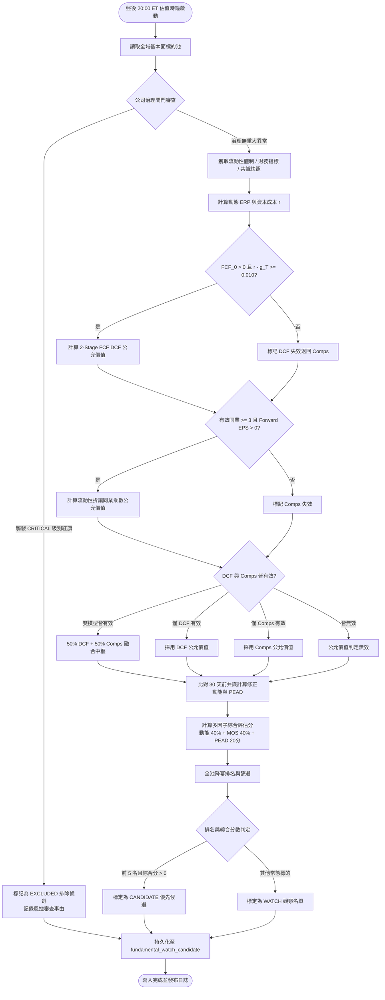

# 分析師修正動能、兩段式現金流折現與同業倍數估值規格書

---

## 1. 核心哲學與適用市場環境

### 1.1 核心哲學
在成熟的股權投資市場中，企業之定價中樞由其未來自由現金流貼現價值決定，而短期至中期的價格發現與估值重塑則由市場分析師之共識預估修正動能（Revision Momentum）所推動。當基本面業績大幅超預期（Positive Surprise）且分析師密集調升未來各期每股盈餘預估時，將引發持久的盈餘公布後漂移（Post-Earnings Announcement Drift, PEAD）。反之，若股價大幅跌破真實內在價值，安全邊際（Margin of Safety, MOS）將為多頭投資人構築堅實的不對稱防禦底線。

Nexus Seeker 基本面分析管線 PR5 聚焦於全景估值與分析師修正動能之深度整合，其核心量化哲學如下：
1. **宏觀流動性體制中樞注入**：拒絕靜態不變的資本成本（Cost of Equity），將芝加哥聯準會金融狀況指數（NFCI）動態注入股權風險溢價（ERP），在貨幣緊縮期主動調高折現率並對同業估值乘數施加指數流動性懲罰。
2. **兩段式自由現金流折現奇點防禦**：採用 2-Stage FCF DCF 模型，以分析師 1 年期預估成長率箝制首階段 5 年成長速度，並嚴推定錨 2.5% 永續成長率。當自由現金流為負或分母利差過窄時，模型優雅退回同業乘數法，杜絕除零極端奇點。
3. **流動性折讓同業乘數法 (Comps Multiple with Liquidity Penalty)**：針對無自由現金流或高成長科技標的，採納至少 3 家同業之中位數前瞻本益比，並結合宏觀流動性體制懲罰因子，防範流動性枯竭時同業泡沫估值之傳染。
4. **基本面修正動能與 PEAD 共振捕獲**：量化追蹤 30 天前後 4 個期限（$0q, +1q, 0y, +1y$）分析師預估斜率與調升廣度比率（Breadth Ratio）。在財報披露後 60 個交易日內，若業績驚喜與修正動能同向爆發，標記為 `PEAD_ALIGNED` 漂移共振標的。
5. **次日基本面觀察名單自動生成**：於每日美股盤後 18:00–22:00（定錨 20:00 ET）由事件時鐘自主排定，全面過濾重大治理風險紅旗，產出次日優先觀察名單（`fundamental_watch_candidate`）。
6. **零交易執行不變量 (Zero-Execution Invariant)**：所有估值結果、安全邊際評定與觀察名單均為純顧問性研究，絕不觸發任何實體帳戶下單或自動清倉。

### 1.2 適用市場環境
- **價值重估與深度折價淘金期**：在市場非理性拋售引發的下行回撤中，透過安全邊際 $\text{MOS} \ge 25\%$ 且無治理紅旗篩選優質深度價值標的。
- **財報發布後 60 日 PEAD 捕捉期**：在標的發布業績後，透過分析師向上修正斜率與正向預期差共振，鎖定具備持續基本面推力之強勢標的。
- **盤前盤後顧問情報映射**：盤後自動排定次日觀察名單，並於 09:00 盤前簡報與 `/fa` 診斷終端中即時視覺化呈現。

---

## 2. 數學模型與量化推導

### 2.1 動態股權風險溢價與權益資本成本折現率模型
折現模型直接採用芝加哥聯準會金融狀況指數（NFCI）對市場股權風險溢價（ERP）進行線性擾動校準：

$$\text{ERP}_t = \text{ERP}_{\text{BASE}} + \lambda_{\text{NFCI}} \cdot \text{clip}(\text{NFCI}_t, -1.0, +2.0)$$

- 基準風險溢價：$\text{ERP}_{\text{BASE}} = 0.045$（4.5%）。
- 敏感度係數：$\lambda_{\text{NFCI}} = 0.010$（NFCI 每緊縮 1 個標準差，市場風險溢價上升 100 bps）。

資產權益資本成本（Cost of Equity, $r$）依資本資產定價模型（CAPM）計算：

$$r = \text{DGS10} + \beta \times \text{ERP}_t$$

其中 $\text{DGS10}$ 為美國 10 年期國債殖利率（小數計），資產貝他值進行物理界限箝制：$\beta = \text{clip}(\beta_{\text{asset}}, 0.5, 2.0)$。若未獲取貝他值，預設為 $1.0$。

### 2.2 兩段式每股自由現金流折現模型 (Two-Stage FCF DCF)
兩段式折現模型將現金流分為首階段（第 1–5 年）預估成長期與第二階段永續終端價值（Terminal Value）：

$$FV_{\text{DCF}} = \sum_{t=1}^{5} \frac{FCF_0 \times (1 + g_1)^t}{(1 + r)^t} + \frac{FCF_0 \times (1 + g_1)^5 \times (1 + g_T)}{(r - g_T) \times (1 + r)^5}$$

- $FCF_0$：標的近 12 個月每股自由現金流（FCF per share TTM）。若 $FCF_0 \le 0$，DCF 模型自動失效並退回同業乘數法。
- $g_1$：未來 5 年預估複合成長率，以分析師 1 年期預估成長率 $g_{\text{est}}$ 進行區間箝制：
  $$g_1 = \text{clip}(g_{\text{est}}, -0.10, +0.25)$$
- $g_T$：永續終端成長率，嚴格定錨於全美長期潛在 GDP 增長率 $2.5\%$（0.025）：
  $$g_T = 0.025$$
- **分母利差防禦門檻 (Spread Constraint)**：
  為杜絕無風險利差過度壓縮或分母除以零之數學奇點，若折現率與終端成長率之差過窄，強制拒絕輸出 DCF：
  $$r - g_T < 0.010 \implies \text{DCF 判定無效 (SPREAD\_TOO\_NARROW)}$$

### 2.3 流動性折讓同業乘數法模型 (Comps Multiple with Liquidity Penalty)
針對處於微利、虧損或現金流重投資期之標的，以同業群體中位數本益比為基礎，並施加宏觀流動性體制懲罰因子：

$$FV_{\text{Comps}} = \text{Forward EPS} \times \left( \text{Median}(\text{Peers Forward PE}) \times e^{-0.10 \times \text{clip}(\text{NFCI}_t, -1.0, +2.0)} \right)$$

- 有效性約束：
  1. $\text{Forward EPS} \le 0$ 時同業乘數法失效。
  2. 具備正向本益比之有效同業數量必須滿足 $N_{\text{peers}} \ge 3$。
  3. $\text{Median}(\text{Peers Forward PE}) \le 0$ 則乘數無效。

### 2.4 公允價值整合與安全邊際模型 (Margin of Safety, MOS)
系統依模型有效性執行公允價值中樞整合：

$$FV = \begin{cases}
\frac{FV_{\text{DCF}} + FV_{\text{Comps}}}{2} & \text{若兩者皆有效 (BLENDED)} \\
FV_{\text{Comps}} & \text{若 } FCF_0 \le 0 \lor \text{DCF 拒絕 (COMPS\_ONLY)} \\
FV_{\text{DCF}} & \text{若同業不足 3 家 (DCF\_ONLY)} \\
\text{None} & \text{若兩者皆無效 (NONE)}
\end{cases}$$

安全邊際（MOS）定義為公允價值相對於當前現貨市價之折價幅度：

$$MOS = \frac{FV - \text{Spot Price}}{FV}$$

- 深度價值評估：當 $MOS \ge 0.25$（安全邊際達 25% 以上）且標的未觸發任何治理紅旗審查時，正式評估為深度價值標的（`DEEP_VALUE`）。

### 2.5 分析師修正動能模型與 PEAD 捕捉 (Revision Momentum & PEAD)
依據標的 30 天前後各期限每股盈餘預估值變動斜率與調升廣度，量化分析師修正動能：

$$\text{Slope}_h = \frac{\text{EPS}_{h, t} - \text{EPS}_{h, t-30d}}{\max(|\text{EPS}_{h, t-30d}|, \text{FLOOR}_{\text{EPS}})}, \quad h \in \{0q, +1q, 0y, +1y\}$$

- 門檻參數：$\text{FLOOR}_{\text{EPS}} = 0.05$ 美元。
- 調升/調降廣度比率：
  $$\text{Breadth} = \frac{N_{\text{up, 30d}} - N_{\text{down, 30d}}}{N_{\text{up, 30d}} + N_{\text{down, 30d}} + \epsilon}$$
  若無任何調整則 $\text{Breadth} = 0.0$。

**基本面修正動能綜合評分 (Revision Momentum Score)**：

$$\text{Score}_{\text{Rev}} = 100 \times \left[ 0.70 \times \sum_{h} w_h \cdot \text{clip}\left(\frac{\text{Slope}_h}{0.20}, -1.0, 1.0\right) + 0.30 \times \text{Breadth} \right]$$

- 期限權重：$w_{0q} = 0.20, w_{+1q} = 0.30, w_{0y} = 0.20, w_{+1y} = 0.30$（若部分期限缺失，現存項自動重新正規化至權重和為 1.0）。
- 分數範圍箝制於 $[-100.0, +100.0]$。

**PEAD 共振標記 (PEAD Alignment)**：
當前日期距離最近一次財報公布日 $\le 60$ 交易日，且業績預期差綜合評分與分析師修正動能同向且具備顯著性時：

$$\text{sign}(\text{Surprise Score}) == \text{sign}(\text{Score}_{\text{Rev}}) \quad \land \quad |\text{Surprise Score}| \ge 15.0 \quad \land \quad |\text{Score}_{\text{Rev}}| \ge 15.0$$

系統正式標註該標的為 `PEAD_ALIGNED`（盈餘公布後漂移共振）。

---

## 3. 決策邏輯與狀態機 / 流程圖

基本面管線在估值與動能評定中的狀態轉移與次日候選生成架構如下：

---

## 4. 關鍵具名常數與物理約束

本模型中所有核心常數與量化邊界均採用具名常數配置，禁止在邏輯中出現未命名的魔法數字：

| 具名常數代碼 | 數值 / 預設值 | 物理量綱 | 業務語意與物理約束說明 |
|---|---|---|---|
| `ERP_BASE` | `0.045` | 小數比率 (4.5%) | 股權風險溢價中樞基準值 |
| `LAMBDA_NFCI` | `0.010` | 敏感度因子 | NFCI 每緊縮 1 個標準差對 ERP 的線性擾動增量 |
| `DEFAULT_PERPETUAL_GROWTH` | `0.025` | 小數比率 (2.5%) | 兩段式 DCF 永續終端成長率定錨 ($g_T$) |
| `MIN_SPREAD_THRESHOLD` | `0.010` | 小數比率 (1.0%) | 折現率與終端成長率分母安全利差防禦下限 ($r - g_T \ge 0.010$) |
| `MIN_PEERS_COUNT` | `3` | 家數整數 | 流動性折讓同業乘數法最低有效正本益比同業數量門檻 |
| `DEEP_VALUE_MOS_THRESHOLD` | `0.25` | 小數比率 (25%) | 評定深度價值標的所需之最低安全邊際門檻 |
| `FLOOR_EPS` | `0.05` | 美元 ($) | 分析師預估變動斜率計算之每股盈餘分母安全門檻 |
| `SLOPE_NORMALIZER` | `0.20` | 小數比率 (20%) | 分析師 30 天每股盈餘上修斜率滿分歸一化尺度 |
| `SLOPE_WEIGHT` | `0.70` | 權重比率 (70%) | 分析師修正動能分數中斜率項權重 |
| `BREADTH_WEIGHT` | `0.30` | 權重比率 (30%) | 分析師修正動能分數中廣度項權重 |
| `PEAD_MAX_DAYS` | `60` | 交易日數 | 盈餘公布後漂移 (PEAD) 共振標記有效觀察窗口上限 |
| `PEAD_THRESHOLD` | `15.0` | 分數絕對值 | 觸發 PEAD 共振所需之業績驚喜與修正動能最低顯著性門檻 |

---

## 5. 邊界條件、風控熔斷與例外處理

### 5.1 負自由現金流與成長率極值箝制
1. **負現金流退回保護**：當企業處於擴張投資期導致每股自由現金流 $FCF_0 \le 0$ 時，DCF 模組強制輸出無效並記錄 `FCF_NON_POSITIVE`，決策路由自動退回同業乘數法。
2. **分析師極端成長率箝制**：若分析師發布極度樂觀之預估（例如 $+80\%$ 增長），首階段 5 年複合增長率強制箝制於 $+25\%$ 上限；若分析師預估極度悲觀，則箝制於 $-10\%$ 下限，防範極端參數扭曲長期價值。

### 5.2 宏觀利差倒掛與分母奇點熔斷
當美國國債殖利率倒掛或折現率受到極度壓制，使得 $r - g_T < 0.010$ 時，若強行折現將導致終端價值膨脹至無限大。系統強制拒絕 DCF 計算，並輸出 `SPREAD_TOO_NARROW` 拒絕原因，防止系統產出荒謬估值。

### 5.3 重大公司治理審查熔斷
若標的於 SEC 申報中觸發 `CRITICAL` 級別重大治理風控紅旗（如 8-K Item 4.02 財報不可信賴性重編或會計師離職），系統直接將其列入 `EXCLUDED` 排除狀態，並壓制任何安全邊際判定（標記為 `DEEP_VALUE_SUPPRESSED_BY_GOVERNANCE`），嚴禁向使用者推送高風險治理瑕疵標的。

### 5.4 缺失資料優雅降級
- 同業數量不足 3 家時，自動放棄同業倍數法，僅依賴有效之 DCF 模型。
- 分析師歷史快照不足 30 天時，以現存歷史最新快照作為基底，廣度比率退化為現有期限斜率之方向計數。

---

## 6. 核心程式碼檔案路徑關聯

本規格書對應之核心實作檔案與持久層模組清單如下：

- 純量化演算法葉模組：
  - `nexus_core/market_analysis/fundamental_pipeline/revision_momentum.py`
  - `nexus_core/market_analysis/fundamental_pipeline/fair_value.py`
- 非同步協調與時鐘服務：
  - `nexus_core/services/valuation_service.py`
  - `nexus_core/services/fundamental_clock_service.py`
- 資料庫持久層與遷移腳本：
  - `nexus_core/database/fundamental_pipeline.py`
  - `nexus_core/database/migrations/v094_add_valuation_and_watch.py`
- 呈現層與互動診斷終端：
  - `nexus_core/cogs/fundamental_terminal.py`
  - `nexus_core/cogs/embed_builders/order_embeds/pre_market_briefing.py`
  - `nexus_core/cogs/analyst_agent.py`
- 離線前向校準報告：
  - `nexus_core/calibration/fundamental_forward_report.py`
